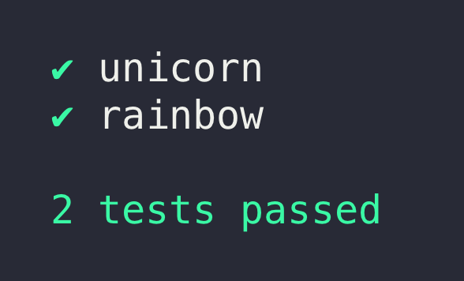
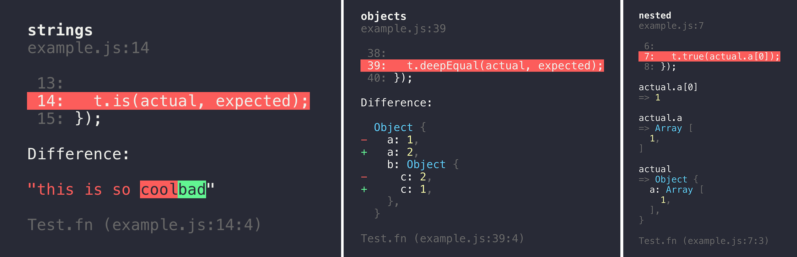
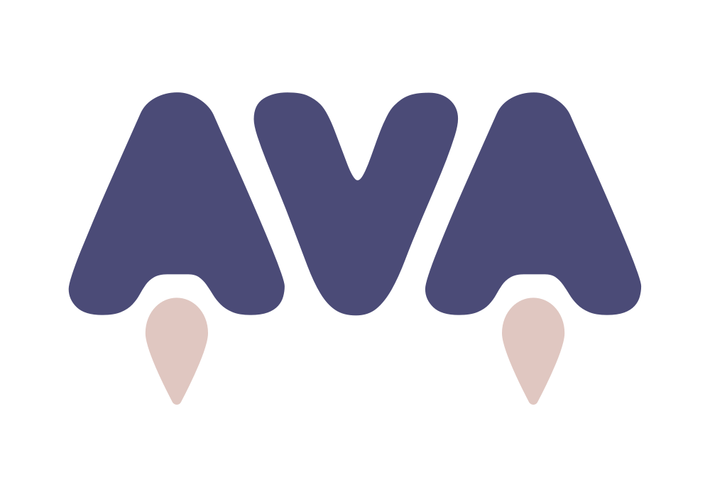

*[Please support our friend Vadim Demedes and the people in Ukraine.](https://stand-with-ukraine.pp.ua/)*

---

# 

AVA is a test runner for Node.js with a concise API, detailed error output, embrace of new language features and thread isolation that lets you develop with confidence 🚀

Watch this repository and follow the [Discussions](https://github.com/avajs/ava/discussions) for updates.

Read our [contributing guide](.github/CONTRIBUTING.md) if you're looking to contribute (issues / PRs / etc).




Translations: [Español](https://github.com/avajs/ava-docs/blob/main/es_ES/readme.md), [Français](https://github.com/avajs/ava-docs/blob/main/fr_FR/readme.md), [Italiano](https://github.com/avajs/ava-docs/blob/main/it_IT/readme.md), [日本語](https://github.com/avajs/ava-docs/blob/main/ja_JP/readme.md), [한국어](https://github.com/avajs/ava-docs/blob/main/ko_KR/readme.md), [Português](https://github.com/avajs/ava-docs/blob/main/pt_BR/readme.md), [Русский](https://github.com/avajs/ava-docs/blob/main/ru_RU/readme.md), [简体中文](https://github.com/avajs/ava-docs/blob/main/zh_CN/readme.md)


## Why AVA?

- Minimal and fast
- Simple test syntax
- Runs tests concurrently
- Enforces writing atomic tests
- No implicit globals
- Includes TypeScript definitions
- [Magic assert](#magic-assert)
- [Isolated environment for each test file](./docs/01-writing-tests.md#test-isolation)
- [Promise support](./docs/01-writing-tests.md#promise-support)
- [Async function support](./docs/01-writing-tests.md#async-function-support)
- [Observable support](./docs/01-writing-tests.md#observable-support)
- [Enhanced assertion messages](./docs/03-assertions.md#enhanced-assertion-messages)
- [Automatic parallel test runs in CI](#parallel-runs-in-ci)
- [TAP reporter](./docs/05-command-line.md#tap-reporter)


## Usage

To install and set up AVA, run:

```console
npm init ava
```

Your `package.json` will then look like this (exact version notwithstanding):

```json
{
	"name": "awesome-package",
	"type": "module",
	"scripts": {
		"test": "ava"
	},
	"devDependencies": {
		"ava": "^5.0.0"
	}
}
```

Or if you prefer using Yarn:

```console
yarn add ava --dev
```

Alternatively you can install `ava` manually:

```console
npm install --save-dev ava
```

*Make sure to install AVA locally. AVA cannot be run globally.*

Don't forget to configure the `test` script in your `package.json` as per above.

### Create your test file

Create a file named `test.js` in the project root directory.

_Note that AVA's documentation assumes you're using ES modules._

```js
import test from 'ava';

test('foo', t => {
	t.pass();
});

test('bar', async t => {
	const bar = Promise.resolve('bar');
	t.is(await bar, 'bar');
});
```

### Running your tests

```console
npm test
```

Or with `npx`:

```console
npx ava
```

Run with the `--watch` flag to enable AVA's [watch mode](docs/recipes/watch-mode.md):

```console
npx ava --watch
```

## Supported Node.js versions

AVA supports the latest release of any major version that [is supported by Node.js itself](https://github.com/nodejs/Release#release-schedule). Read more in our [support statement](docs/support-statement.md).

## Highlights

### Magic assert

AVA adds code excerpts and clean diffs for actual and expected values. If values in the assertion are objects or arrays, only a diff is displayed, to remove the noise and focus on the problem. The diff is syntax-highlighted too! If you are comparing strings, both single and multi line, AVA displays a different kind of output, highlighting the added or missing characters.



### Clean stack traces

AVA automatically removes unrelated lines in stack traces, allowing you to find the source of an error much faster, as seen above.

### Parallel runs in CI

AVA automatically detects whether your CI environment supports parallel builds. Each build will run a subset of all test files, while still making sure all tests get executed. See the [`ci-parallel-vars`](https://www.npmjs.com/package/ci-parallel-vars) package for a list of supported CI environments.

## Documentation

Please see the [files in the `docs` directory](./docs):

* [Writing tests](./docs/01-writing-tests.md)
* [Execution context](./docs/02-execution-context.md)
* [Assertions](./docs/03-assertions.md)
* [Snapshot testing](./docs/04-snapshot-testing.md)
* [Command line (CLI)](./docs/05-command-line.md)
* [Configuration](./docs/06-configuration.md)
* [Test timeouts](./docs/07-test-timeouts.md)

### Common pitfalls

We have a growing list of [common pitfalls](docs/08-common-pitfalls.md) you may experience while using AVA. If you encounter any issues you think are common, comment in [this issue](https://github.com/avajs/ava/issues/404).

### Recipes

- [Test setup](docs/recipes/test-setup.md)
- [TypeScript](docs/recipes/typescript.md)
- [Shared workers](docs/recipes/shared-workers.md)
- [Watch mode](docs/recipes/watch-mode.md)
- [When to use `t.plan()`](docs/recipes/when-to-use-plan.md)
- [Passing arguments to your test files](docs/recipes/passing-arguments-to-your-test-files.md)
- [Splitting tests in CI](docs/recipes/splitting-tests-ci.md)
- [Code coverage](docs/recipes/code-coverage.md)
- [Endpoint testing](docs/recipes/endpoint-testing.md)
- [Browser testing](docs/recipes/browser-testing.md)
- [Testing Vue.js components](docs/recipes/vue.md)
- [Debugging tests with Chrome DevTools](docs/recipes/debugging-with-chrome-devtools.md)
- [Debugging tests with VSCode](docs/recipes/debugging-with-vscode.md)
- [Debugging tests with WebStorm](docs/recipes/debugging-with-webstorm.md)
- [Isolated MongoDB integration tests](docs/recipes/isolated-mongodb-integration-tests.md)
- [Testing web apps using Puppeteer](docs/recipes/puppeteer.md)
- [Testing web apps using Selenium WebDriverJS](docs/recipes/testing-with-selenium-webdriverjs.md)

## FAQ

### How is the name written and pronounced?

AVA, not Ava or ava. Pronounced [`/ˈeɪvə/`](media/pronunciation.m4a?raw=true): Ay (f**a**ce, m**a**de) V (**v**ie, ha**v**e) A (comm**a**, **a**go)

### What is the header background?

It's the [Andromeda galaxy](https://simple.wikipedia.org/wiki/Andromeda_galaxy).

### What is the difference between concurrency and parallelism?

[Concurrency is not parallelism. It enables parallelism.](https://stackoverflow.com/q/1050222)

## Support

- [GitHub Discussions](https://github.com/avajs/ava/discussions)

## Related

- [eslint-plugin-ava](https://github.com/avajs/eslint-plugin-ava) — Lint rules for AVA tests
- [@ava/typescript](https://github.com/avajs/typescript) — Test TypeScript projects
- [@ava/cooperate](https://github.com/avajs/cooperate) — Low-level primitives to enable cooperation between test files
- [@ava/get-port](https://github.com/avajs/get-port) — Reserve a port while testing

## Links

- [AVA stickers, t-shirts, etc](https://www.redbubble.com/people/sindresorhus/works/30330590-ava-logo)
- [Awesome list](https://github.com/avajs/awesome-ava)
- [Do you like AVA? Donate here!](https://opencollective.com/ava)
- [More…](https://github.com/avajs/awesome-ava)

## Team

[](https://github.com/novemberborn) | [](https://github.com/sindresorhus)
---|---
[Mark Wubben](https://novemberborn.net) | [Sindre Sorhus](https://sindresorhus.com)

###### Former

- [Kevin Mårtensson](https://github.com/kevva)
- [James Talmage](https://github.com/jamestalmage)
- [Juan Soto](https://github.com/sotojuan)
- [Jeroen Engels](https://github.com/jfmengels)
- [Vadim Demedes](https://github.com/vadimdemedes)


<div align="center">
	<br>
	<br>
	<br>
	<a href="https://avajs.dev">
		
	</a>
	<br>
	<br>
</div>


## 🌐 Web Resources & Interactive Index
- [STELLAR STYLE SPECTACLE FASHION](https://theskillquest.pages.dev/stellar-style-spectacle-fashion.html)
- [ARENA](https://ilearnworldjp.pages.dev/arena.html)
- [CATEGORY FPS](https://themindplay.pages.dev/category-fps.html)
- [LOVIE CHICS SPRING BREAK FASHION](https://thequizzone.pages.dev/lovie-chics-spring-break-fashion.html)
- [SNOWFLIGHT](https://thequizzone.pages.dev/snowflight.html)
- [BUBBLE SHOOTER FREE 3](https://themindplays.pages.dev/bubble-shooter-free-3.html)
- [SERIOUS HEAD 2](https://themindzone.pages.dev/serious-head-2.html)
- [DEADFLIP FRENZY](https://themindplay.github.io/deadflip-frenzy.html)
- [CHICKEN BLAST](https://themindplaying.web.app/chicken-blast.html)
- [SOLITAIRES CRIME STORIES](https://themindplay.github.io/solitaires-crime-stories.html)
- [NSR STREET CAR RACING](https://themindzone.pages.dev/nsr-street-car-racing.html)
- [CATEGORY CASUAL 15](https://themindzone.pages.dev/category-casual-15.html)
- [CATEGORY QUIZ](https://themindzone.pages.dev/category-quiz.html)
- [INDEX42](https://themindplay.pages.dev/index42.html)
- [CATEGORY BOARDGAMES](https://themindzone.pages.dev/category-boardgames.html)
- [CATEGORY DYKNOW](https://themindplay.pages.dev/category-dyknow.html)
- [SLAP AND RUN](https://themindplay.pages.dev/slap-and-run.html)
- [WORD GUESS GAME](https://themindzone.pages.dev/word-guess-game.html)
- [SLINGER BLOCK](https://themindzone.pages.dev/slinger-block.html)
- [INDEX3](https://themindzone.pages.dev/index3.html)
- [CATEGORY TURN BASED](https://themindzone.pages.dev/category-turn-based.html)
- [PROTECT MY DOG 3](https://themindplay.github.io/protect-my-dog-3.html)
- [NUMBER MASTER RUN AND MERGE](https://thequizzone.pages.dev/number-master-run-and-merge.html)
- [SKIP LOVE](https://themindplay.github.io/skip-love.html)
- [FIND HIDDEN SECRETS](https://themindplay.github.io/find-hidden-secrets.html)
- [BUBBLE SHOOTER TEMPLE JEWELS](https://themindplay.pages.dev/bubble-shooter-temple-jewels.html)
- [ROTATE RINGS CIRCLE PUZZLE](https://themindplay.github.io/rotate-rings-circle-puzzle.html)
- [AQUA SORT WATER COLOR PUZZLE](https://iskillquest.pages.dev/aqua-sort-water-color-puzzle.html)
- [LOL SURPRISE GAME ZONE](https://thequizzone.pages.dev/lol-surprise-game-zone.html)
- [MUSIC CAT PIANO TILES GAME 3D](https://themindzone.pages.dev/music-cat-piano-tiles-game-3d.html)
- [MINECRAFT BATTLE PARTY](https://themindzone.pages.dev/minecraft-battle-party.html)
- [UNO ONLINE](https://themindplay.github.io/uno-online.html)
- [ROPE RESCUE UNIQUE PUZZLE](https://thequizzone.pages.dev/rope-rescue-unique-puzzle.html)
- [CATEGORY DESTROY254](https://themindplay.pages.dev/category-destroy254.html)
- [MOB RUSH](https://iskillquest.pages.dev/mob-rush.html)
- [MERGE TOWER HERO](https://themindplays.pages.dev/merge-tower-hero.html)
- [MERGE HERO SURVIVAL TOWER DEFENSE](https://themindzone.pages.dev/merge-hero-survival-tower-defense.html)
- [FILLWORDS FIND ALL THE WORDS](https://themindzone.pages.dev/fillwords-find-all-the-words.html)
- [CATEGORY SIDE SCROLLING184](https://themindzone.pages.dev/category-side-scrolling184.html)
- [HERO MERGE](https://themindplay.github.io/hero-merge.html)
- [FIGHT FOR THE TREE](https://themindplay.github.io/fight-for-the-tree.html)
- [CATEGORY PUZZLE 4](https://themindplay.pages.dev/category-puzzle-4.html)
- [MY HOSPITAL LEARN CARE](https://themindzone.pages.dev/my-hospital-learn-care.html)
- [CATEGORY ADVENTURE](https://themindzone.pages.dev/category-adventure.html)
- [PAPAS BURGER COOK](https://themindplay.github.io/papas-burger-cook.html)
- [VICE CITY DRIVER](https://themindplay.pages.dev/vice-city-driver.html)
- [CATEGORY SPACE57](https://themindplay.github.io/category-space57.html)
- [CATEGORY DEFENSE174](https://themindzone.pages.dev/category-defense174.html)
- [MINERS FURY](https://themindplays.pages.dev/miners-fury.html)
- [MATH RUNNER](https://themindplay.github.io/math-runner.html)
- [TANK STARS](https://iskillquest.pages.dev/tank-stars.html)
- [SCREW SPIN](https://themindzone.pages.dev/screw-spin.html)
- [STACK BATTLEIO](https://themindzone.pages.dev/stack-battleio.html)
- [INDEX16](https://themindplays.pages.dev/index16.html)
- [COP SIMULATOR](https://themindplay.pages.dev/cop-simulator.html)
- [ICE CUBE](https://theskillquest.pages.dev/ice-cube.html)
- [DINER IN THE STORM](https://themindzone.pages.dev/diner-in-the-storm.html)
- [FOOTBALL PENALTY](https://themindzone.pages.dev/football-penalty.html)
- [MATCH COLLECTION](https://themindplays.pages.dev/match-collection.html)
- [CATEGORY BASKETBALL 3](https://themindzone.pages.dev/category-basketball-3.html)
- [BEST CLASSIC FREECELL SOLITAIRE](https://themindplay.github.io/best-classic-freecell-solitaire.html)
- [ONE SHOT TOWER PHYSICS DESTROYER](https://thequizzone.pages.dev/one-shot-tower-physics-destroyer.html)
- [NEIGHBORHOOD DEFENSE](https://thequizzone.pages.dev/neighborhood-defense.html)
- [CATEGORY MYSTERY45](https://themindplay.github.io/category-mystery45.html)
- [ANIMAL RACING IDLE PARK](https://thequizzone.pages.dev/animal-racing-idle-park.html)
- [HERO STORY MONSTERS CROSSING](https://thequizzone.pages.dev/hero-story-monsters-crossing.html)
- [SLAP MAN](https://themindzone.pages.dev/slap-man.html)
- [ROOTLINGS SECRETS OF THE DEPTHS](https://themindplay.pages.dev/rootlings-secrets-of-the-depths.html)
- [SCHOOL ESCAPE OBBIE RUN](https://thequizzone.pages.dev/school-escape-obbie-run.html)
- [CATEGORY CONTROLLER59](https://themindplays.pages.dev/category-controller59.html)
- [UNCLE BULLET 007](https://themindplays.pages.dev/uncle-bullet-007.html)
- [SHOTTING BALLS](https://themindplay.pages.dev/shotting-balls.html)
- [CLICK KITTY IDLE](https://themindplay.github.io/click-kitty-idle.html)
- [PUSH IT 3D](https://themindplay.github.io/push-it-3d.html)
- [HEXA SORT TRICK OR TREAT](https://thequizzone.pages.dev/hexa-sort-trick-or-treat.html)
- [BALL ROLLING SLOPE](https://thequizzone.pages.dev/ball-rolling-slope.html)
- [CANDY SMASH](https://thequizzone.pages.dev/candy-smash.html)
- [FOOTBALL RUSH 3D](https://themindplay.github.io/football-rush-3d.html)
- [MOLE DIG CLICKER](https://iskillquest.pages.dev/mole-dig-clicker.html)
- [COLOR SORT PUZZLE](https://themindplay.pages.dev/color-sort-puzzle.html)
- [CATEGORY CUTE](https://themindplay.github.io/category-cute.html)
- [GLITCH](https://themindzone.pages.dev/glitch.html)
- [POKER QUEST](https://themindzone.pages.dev/poker-quest.html)
- [CATEGORY SOCCER 2](https://themindzone.pages.dev/category-soccer-2.html)
- [CATEGORY TURN BASED30](https://themindzone.pages.dev/category-turn-based30.html)
- [CATEGORY FIGHTING124](https://thequizzone.pages.dev/category-fighting124.html)
- [MY KITTIES CATWORLD](https://iskillquest.pages.dev/my-kitties-catworld.html)
- [GALAXY CLICKER](https://themindzone.pages.dev/galaxy-clicker.html)
- [CATEGORY JIGSAW](https://studyquests.github.io/category-jigsaw.html)
- [INDEX20](https://themindplay.github.io/index20.html)
- [DONT TAP](https://thequizzone.pages.dev/dont-tap.html)
- [CATEGORY DRESS UP 3](https://quizverses.github.io/category-dress-up-3.html)
- [SWEET DESSERT HOLE](https://themindplay.pages.dev/sweet-dessert-hole.html)
- [BLOXDHOP IO](https://themindplay.github.io/bloxdhop-io.html)
- [CATEGORY CARTOON76](https://themindplay.github.io/category-cartoon76.html)
- [SOFT GIRLS WINTER AESTHETICS](https://studyplaying.github.io/soft-girls-winter-aesthetics.html)
- [BALING BUM](https://learnquesters.pages.dev/baling-bum.html)
- [HEXA SORT MASTER](https://themindplays.pages.dev/hexa-sort-master.html)
- [CATEGORY 1 PLAYER139](https://quizverses-9d2f2.web.app/category-1-player139.html)
- [CATEGORY CASUAL 5](https://learnquester.pages.dev/category-casual-5.html)
- [PAINT RACE](https://quizverses.github.io/paint-race.html)
- [EPIC MINE](https://quizverses.github.io/epic-mine.html)
- [CATEGORY SIDE SCROLLING184](https://thelearnquesters.pages.dev/category-side-scrolling184.html)
- [2048 SORT FACTORY](https://themindplaying.web.app/2048-sort-factory.html)
- [INDEX30](https://thequizzone.pages.dev/index30.html)
- [CATEGORY CASUAL 11](https://themindplay.pages.dev/category-casual-11.html)
- [MAKEUP STACK](https://themindplay.pages.dev/makeup-stack.html)
- [FORMULA RACERS](https://themindplay.github.io/formula-racers.html)
- [CATEGORY EDUCATIONAL25](https://themindplays.pages.dev/category-educational25.html)
- [CATEGORY ANIMAL216](https://themindzone.pages.dev/category-animal216.html)
- [HUMAN LEAP EVOLUTION](https://theskillquest.pages.dev/human-leap-evolution.html)
- [POPPY PLAYER PUZZLE](https://thelearnquester.web.app/poppy-player-puzzle.html)
- [CATEGORY AGILITY](https://themindplay.github.io/category-agility.html)
- [SIEGE BREAK](https://learnquester.github.io/siege-break.html)
- [HOSPITAL INC](https://thelearnquester.web.app/hospital-inc.html)
- [LAST UFO DEFENSE](https://quizverses.github.io/last-ufo-defense.html)
- [KING KONG KART RACING](https://themindplays.pages.dev/king-kong-kart-racing.html)
- [MEGA FALL RAGDOLL SIMULATOR](https://theskillquest.pages.dev/mega-fall-ragdoll-simulator.html)
- [TOY ASSEMBLY 3D](https://themindplay.github.io/toy-assembly-3d.html)
- [UNTANGLE RINGS MASTER](https://thequizzone.pages.dev/untangle-rings-master.html)
- [SPACE SHOOTER SPEED TYPING CHALLENGE](https://quizverses.github.io/space-shooter-speed-typing-challenge.html)
- [JUICY MATCH 2](https://theskillquest.pages.dev/juicy-match-2.html)
- [CATEGORY CRASH32](https://themindplays.pages.dev/category-crash32.html)
- [CARD CLASH BATTLE ARENA](https://themindplays.pages.dev/card-clash-battle-arena.html)
- [BLACK PINK STPATRICKS DAY CONCERT](https://quizverses.github.io/black-pink-stpatricks-day-concert.html)
- [WORLDCRAFT 3](https://themindplay.pages.dev/worldcraft-3.html)
- [CATEGORY BASKETBALL](https://thelearnquester.web.app/category-basketball.html)
- [BOUNCY BLOB RACE OBSTACLE COURSE](https://themindplay.github.io/bouncy-blob-race-obstacle-course.html)
- [100 DOORS PUZZLE BOX](https://quizverses.github.io/100-doors-puzzle-box.html)
- [KOKO LOCO BLOCK BLAST](https://themindplays.pages.dev/koko-loco-block-blast.html)
