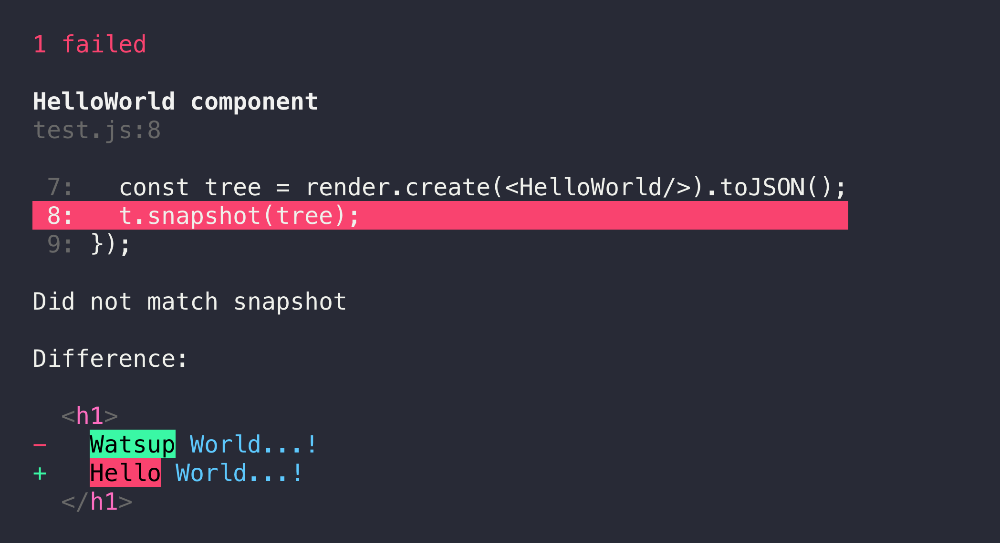

# Snapshot testing

Translations: [Français](https://github.com/avajs/ava-docs/blob/main/fr_FR/docs/04-snapshot-testing.md)

AVA supports snapshot testing, [as introduced by Jest](https://facebook.github.io/jest/docs/snapshot-testing.html), through its [Assertions](./03-assertions.md) interface. You can snapshot any value.

Snapshots are stored alongside your test files. If your tests are in a `test` or `tests` folder the snapshots will be stored in a `snapshots` folder. If your tests are in a `__tests__` folder then they they'll be stored in a `__snapshots__` folder.

Say you have `~/project/test/main.js` which contains snapshot assertions. AVA will create two files:

* `~/project/test/snapshots/main.js.snap`
* `~/project/test/snapshots/main.js.md`

The first file contains the actual snapshot and is required for future comparisons. The second file contains your *snapshot report*. It's regenerated when you update your snapshots. If you commit it to source control you can diff it to see the changes to your snapshot.

AVA will show why your snapshot assertion failed:



You can then check your code. If the change was intentional you can use the `--update-snapshots` (or `-u`) flag to update the snapshots:

```console
$ ava --update-snapshots
```

If you need to update snapshots for only a particular test, you can use `--update-snapshots` together with e.g. `--match` or `.only()` to select the test.

You can specify a fixed location for storing the snapshot files in AVA's [`package.json` configuration](./06-configuration.md):

**`package.json`:**

```json
{
	"ava": {
		"snapshotDir": "custom-directory"
	}
}
```

The snapshot files will be saved in a directory structure that mirrors that of your test files.

If you are running AVA against precompiled test files, AVA will try and use source maps to determine the location of the original files. Snapshots will be stored next to these files, following the same rules as if AVA had executed the original files directly. This is great if you're writing your tests in TypeScript (see our [TypeScript recipe](./recipes/typescript.md)).
