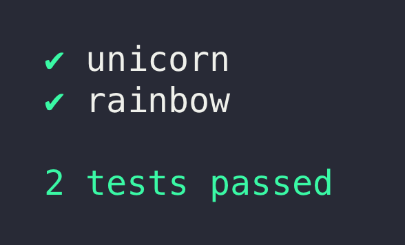
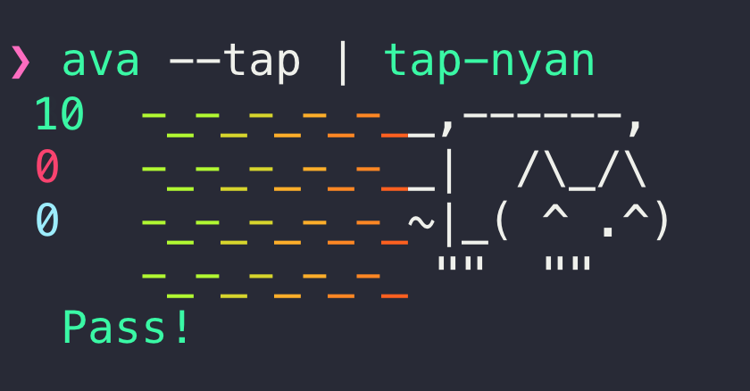

# CLI

Translations: [Français](https://github.com/avajs/ava-docs/blob/master/fr_FR/docs/05-command-line.md)

```console
ava [<pattern>...]
ava debug [<pattern>...]
ava reset-cache

Commands:
  ava [<pattern>...]        Run tests                                  [default]
  ava debug [<pattern>...]  Activate Node.js inspector and run a single test
                            file
  ava reset-cache           Reset AVA's compilation cache and exit

Positionals:
  pattern  Glob patterns to select what test files to run. Leave empty if you
           want AVA to run all test files instead. Add a colon and specify line
           numbers of specific tests to run                             [string]

Options:
  --version               Show version number                          [boolean]
  --color                 Force color output                           [boolean]
  --config                JavaScript file for AVA to read its config from,
                          instead of using package.json or ava.config.js files
  --help                  Show help                                    [boolean]
  --concurrency, -c       Max number of test files running at the same time
                          (Default: CPU cores)                          [number]
  --fail-fast             Stop after first test failure                [boolean]
  --match, -m             Only run tests with matching title (Can be repeated)
                                                                        [string]
  --serial, -s            Run tests serially                           [boolean]
  --tap, -t               Generate TAP output                          [boolean]
  --timeout, -T           Set global timeout (milliseconds or human-readable,
                          e.g. 10s, 2m)                                 [string]
  --update-snapshots, -u  Update snapshots                             [boolean]
  --verbose, -v           Enable verbose output                        [boolean]
  --watch, -w             Re-run tests when files change               [boolean]

Examples:
  ava
  ava test.js
  ava test.js:4,7-9
```

*Note that the CLI will use your local install of AVA when available, even when run globally.*

AVA searches for test files using the following patterns:

* `test.js`
* `src/test.js`
* `source/test.js`
* `**/test-*.js`
* `**/*.spec.js`
* `**/*.test.js`
* `**/test/**/*.js`
* `**/tests/**/*.js`
* `**/__tests__/**/*.js`

Files inside `node_modules` are *always* ignored. So are files starting with `_` or inside of directories that start with a single `_`. Additionally, files matching these patterns are ignored by default, unless different patterns are configured:

* `**/__tests__/**/__helper__/**/*`
* `**/__tests__/**/__helpers__/**/*`
* `**/__tests__/**/__fixture__/**/*`
* `**/__tests__/**/__fixtures__/**/*`
* `**/test/**/helper/**/*`
* `**/test/**/helpers/**/*`
* `**/test/**/fixture/**/*`
* `**/test/**/fixtures/**/*`
* `**/tests/**/helper/**/*`
* `**/tests/**/helpers/**/*`
* `**/tests/**/fixture/**/*`
* `**/tests/**/fixtures/**/*`

When using `npm test`, you can pass positional arguments directly `npm test test2.js`, but flags needs to be passed like `npm test -- --verbose`.

## Running tests with matching titles

The `--match` flag allows you to run just the tests that have a matching title. This is achieved with simple wildcard patterns. Patterns are case insensitive. See [`matcher`](https://github.com/sindresorhus/matcher) for more details.

Match titles ending with `foo`:

```console
npx ava --match='*foo'
```

Match titles starting with `foo`:

```console
npx ava --match='foo*'
```

Match titles containing `foo`:

```console
npx ava --match='*foo*'
```

Match titles that are *exactly* `foo` (albeit case insensitively):

```console
npx ava --match='foo'
```

Match titles not containing `foo`:

```console
npx ava --match='!*foo*'
```

Match titles starting with `foo` and ending with `bar`:

```console
npx ava --match='foo*bar'
```

Match titles starting with `foo` or ending with `bar`:

```console
npx ava --match='foo*' --match='*bar'
```

Note that a match pattern takes precedence over the `.only` modifier. Only tests with an explicit title are matched. Tests without titles or whose title is derived from the implementation function will be skipped when `--match` is used.

Here's what happens when you run AVA with a match pattern of `*oo*` and the following tests:

```js
test('foo will run', t => {
	t.pass();
});

test('moo will also run', t => {
	t.pass();
});

test.only('boo will run but not exclusively', t => {
	t.pass();
});

// Won't run, no title
test(function (t) {
	t.fail();
});

// Won't run, no explicit title
test(function foo(t) {
	t.fail();
});
```

## Running tests at specific line numbers

AVA lets you run tests exclusively by referring to their line numbers. Target a single line, a range of lines or both. You can select any line number of a test.

The format is a comma-separated list of `[X|Y-Z]` where `X`, `Y` and `Z` are integers between `1` and the last line number of the file.

This feature is only available from the command line.

### Running a single test

To only run a particular test in a file, append the line number of the test to the path or pattern passed to AVA.

Running

```console
npx ava test.js:3
```

for the following tests would result in:

`test.js`

```js
1: // Run
2: test('unicorn', t => {
3:   t.pass();
4: });
5:
6: // Not run
7: test('rainbow', t => {
8:  t.fail();
9: });
```

Any line number between `2` and `4` would select the `unicorn` test above.

### Running multiple tests

To run multiple tests, either target them one by one or select a range of line numbers. As line numbers are given per file, you can run multiple files with different line numbers for each file. If the same file is provided multiple times, line numbers are merged and only run once.

### Examples

Single line numbers:

```console
npx ava test.js:2,9
```

Range:

```console
npx ava test.js:4-7
```

Mix of single line number and range:

```console
npx ava test.js:4,9-12
```

Different files:

```console
npx ava test.js:3 test2.js:4,7-9
```

When running a file with and without line numbers, line numbers takes precedence.

## Resetting AVA's cache

AVA may cache certain files, especially when you use our [`@ava/babel`](https://github.com/avajs/babel) provider. If it seems like your latest changes aren't being picked up by AVA you can reset the cache by running:

```console
npx ava reset-cache
```

This deletes all files in the `node_modules/.cache/ava` directory.

## Reporters

By default AVA uses a minimal reporter:


Use the `--verbose` flag to enable the verbose reporter. This is always used in CI environments unless the [TAP reporter](#tap-reporter) is enabled.



### TAP reporter

AVA supports the TAP format and thus is compatible with [any TAP reporter](https://github.com/sindresorhus/awesome-tap#reporters). Use the `--tap` flag to enable TAP output.

```console
$ npx ava --tap | npx tap-nyan
```



Please note that the TAP reporter is unavailable when using [watch mode](./recipes/watch-mode.md).
