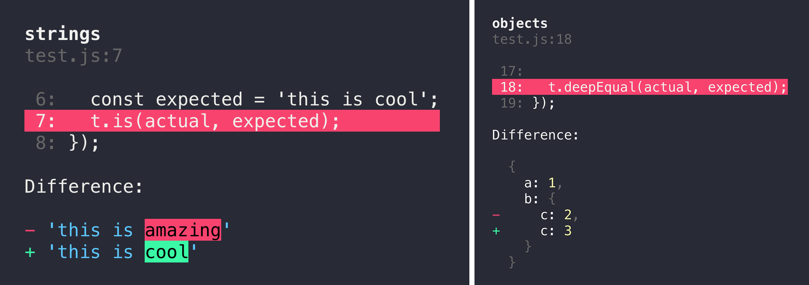

## Supported Node.js versions

AVA supports the latest release of any major version that [is supported by Node.js itself](https://github.com/nodejs/Release#release-schedule). Read more in our [support statement](/support-statement.md).

## Highlights

### Magic assert

AVA adds code excerpts and clean diffs for actual and expected values. If values in the assertion are objects or arrays, only a diff is displayed, to remove the noise and focus on the problem. The diff is syntax-highlighted too! If you are comparing strings, both single and multi line, AVA displays a different kind of output, highlighting the added or missing characters.

### Clean stack traces

AVA automatically removes unrelated lines in stack traces, allowing you to find the source of an error much faster, as seen above.

### Latest JavaScript support

AVA uses [Babel 7](https://babeljs.io) so you can use the latest JavaScript syntax in your tests. There is no extra setup required. You don't need to be using Babel in your own project for this to work either.

We aim support all [finished syntax proposals](https://github.com/tc39/proposals/blob/master/finished-proposals.md), as well as all syntax from ratified JavaScript versions (e.g. ES2017). See our [`@ava/stage-4`](https://github.com/avajs/babel-preset-stage-4) preset for the currently supported proposals.

Please note that we do not add or modify built-ins. For example, if you use [`Object.entries()`](https://github.com/tc39/proposal-object-values-entries) in your tests, they will crash in Node.js 6 which does not implement this method.

You can disable this syntax support, or otherwise customize AVA's Babel pipeline. See our [Babel recipe] for more details.

### Parallel runs in CI

AVA automatically detects whether your CI environment supports parallel builds. Each build will run a subset of all test files, while still making sure all tests get executed. See the [`ci-parallel-vars`](https://www.npmjs.com/package/ci-parallel-vars) package for a list of supported CI environments.

### Common pitfalls

We have a growing list of [common pitfalls](guide/08-common-pitfalls.md) you may experience while using AVA. If you encounter any issues you think are common, comment in [this issue](https://github.com/avajs/ava/issues/404).

## FAQ

### Why not `mocha`, `tape`, `tap`?

Mocha requires you to use implicit globals like `describe` and `it` with the default interface (which most people use). It's not very opinionated and executes tests serially without process isolation, making it slow.

Tape and tap are pretty good. AVA is highly inspired by their syntax. They too execute tests serially. Their default [TAP](https://testanything.org) output isn't very user-friendly though so you always end up using an external tap reporter.

In contrast AVA is highly opinionated and runs tests concurrently, with a separate process for each test file. Its default reporter is easy on the eyes and yet AVA still supports TAP output through a CLI flag.

### How is the name written and pronounced?

AVA, not Ava or ava. Pronounced [/ˈeɪvə/ ay-və](media/pronunciation.m4a?raw=true).

### What is the header background?

It's the [Andromeda galaxy](https://simple.wikipedia.org/wiki/Andromeda_galaxy).

### What is the difference between concurrency and parallelism?

[Concurrency is not parallelism. It enables parallelism.](https://stackoverflow.com/q/1050222)

## Support

- [Stack Overflow](https://stackoverflow.com/questions/tagged/ava)
- [Spectrum](https://spectrum.chat/ava)
- [Twitter](https://twitter.com/ava__js)

## Team

|  |  |  |
| ----------------------------------------------------------------------------------------------- | ------------------------------------------------------------------------------------------------- | ------------------------------------------------------------------------------------------------- |
| [Mark Wubben](https://novemberborn.net)                                                         | [Sindre Sorhus](http://sindresorhus.com)                                                          | [Vadim Demedes](https://github.com/vadimdemedes)                                                  |

###### Former

- [Kevin Mårtensson](https://github.com/kevva)
- [James Talmage](https://github.com/jamestalmage)
- [Juan Soto](https://github.com/sotojuan)
- [Jeroen Engels](https://github.com/jfmengels)

	 
	 
	 
	
	 
	 

[babel recipe]: /recipes/babel.md
