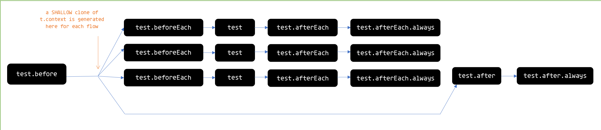

# Using Context in Tests

Translations: TBD

`t.context` allows you to set up the test environment for the current file / test context.

## Intro

Set your `t.context` value(s) within the `test.beforeEach` block:

```js
test.beforeEach(t => {
  t.context.data = generateUniqueData();
  t.context.foo = 'bar';
});
```

You may then use the `t.context` object in your tests.

```javascript
test('context is bar', t => {
  t.is(t.context.foo, 'bar'); // => passes
});
```


## Context Flow



######blue arrows show how t.context is persisted across test flows.

Context created in `.before()` hooks is [cloned](https://www.npmjs.com/package/lodash.clone) before it is passed to `.beforeEach()` hooks and / or tests. The `.after()` and `.after.always()` hooks receive the original context value.

For `.beforeEach()`, `.afterEach()` and `.afterEach.always()` hooks the context is *not* shared between different tests, allowing you to set up data such that it will not leak to other tests.


## Examples of Context Flow

### 1. Original context created in `test.before()` is always available in `test.after()`

```javascript
test.before(t => {
  t.context.foo = 'foo'
})

test.beforeEach(t => {
  t.context.beforeEachFoo = 'bar';
})

test('something', t => {
  t.context.foo = bar; // attempt to change foo in test.before
  
  t.context.testFoo = 'bar';
})

test.afterEach(t => {
  t.context.afterEachFoo = 'bar';
})

// context changes in test.beforeEach, test and test.afterEach does not affect context in test.after()
test.after(t => {
  console.log(t.context.foo); // foo (change in test is not reflected)
  console.log(t.context.beforeEachFoo); // undefined
  console.log(t.context.afterEachFoo); // undefined
})
```


### 2. Context in `test.beforeEach()` and `test.afterEach()` is not available across different tests

`sometest.js`:

```javascript
test.beforeEach(t => {
  t.context.foo = 'pony'
})

test('Bear test', t => {
  t.context.foo = 'BEAR'
  // rest of test
})

test('other test', t => {
  // test that doesn't change t.context.foo
})

test('other test 2', t => {
  // test that doesn't change t.context.foo
})

test.afterEach(t => {
  console.log('context foo is ', t.context.foo);
})
```

`console output`:

```bash
$ ava
context foo is BEAR # 'BEAR' assignment is carried over to afterEach hook of (only) that test
context foo is pony # not affected by the 'BEAR' assignment
context foo is pony # also not affected

# serial or non-serial doesn't change this
$ ava --serial
context foo is BEAR
context foo is pony
context foo is pony

```


Have fun!