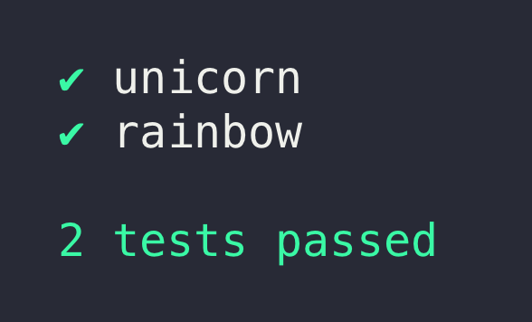
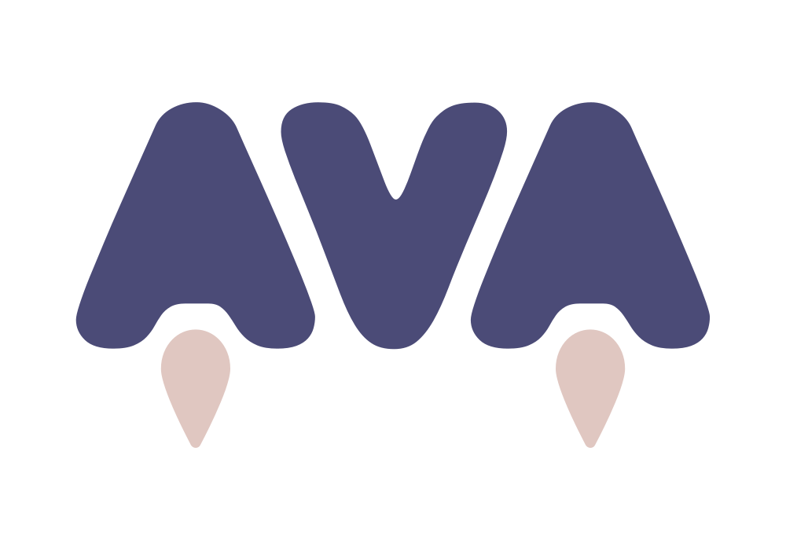

[](https://vshymanskyy.github.io/StandWithUkraine/)

# 

AVA is a test runner for Node.js with a concise API, detailed error output, embrace of new language features and process isolation that lets you develop with confidence 🚀

Follow the [AVA Twitter account](https://twitter.com/ava__js) for updates.

Read our [contributing guide](.github/CONTRIBUTING.md) if you're looking to contribute (issues / PRs / etc).




Translations: [Español](https://github.com/avajs/ava-docs/blob/main/es_ES/readme.md), [Français](https://github.com/avajs/ava-docs/blob/main/fr_FR/readme.md), [Italiano](https://github.com/avajs/ava-docs/blob/main/it_IT/readme.md), [日本語](https://github.com/avajs/ava-docs/blob/main/ja_JP/readme.md), [한국어](https://github.com/avajs/ava-docs/blob/main/ko_KR/readme.md), [Português](https://github.com/avajs/ava-docs/blob/main/pt_BR/readme.md), [Русский](https://github.com/avajs/ava-docs/blob/main/ru_RU/readme.md), [简体中文](https://github.com/avajs/ava-docs/blob/main/zh_CN/readme.md)


## Why AVA?

- Minimal and fast
- Simple test syntax
- Runs tests concurrently
- Enforces writing atomic tests
- No implicit globals
- Includes TypeScript definitions
- [Magic assert](#magic-assert)
- [Isolated environment for each test file](./docs/01-writing-tests.md#process-isolation)
- [Promise support](./docs/01-writing-tests.md#promise-support)
- [Async function support](./docs/01-writing-tests.md#async-function-support)
- [Observable support](./docs/01-writing-tests.md#observable-support)
- [Enhanced assertion messages](./docs/03-assertions.md#enhanced-assertion-messages)
- [Automatic parallel test runs in CI](#parallel-runs-in-ci)
- [TAP reporter](./docs/05-command-line.md#tap-reporter)


## Usage

To install and set up AVA, run:

```console
npm init ava
```

Your `package.json` will then look like this (exact version notwithstanding):

```json
{
	"name": "awesome-package",
	"type": "module",
	"scripts": {
		"test": "ava"
	},
	"devDependencies": {
		"ava": "^5.0.0"
	}
}
```

Or if you prefer using Yarn:

```console
yarn add ava --dev
```

Alternatively you can install `ava` manually:

```console
npm install --save-dev ava
```

*Make sure to install AVA locally. As of AVA 4 it can no longer be run globally.*

Don't forget to configure the `test` script in your `package.json` as per above.

### Create your test file

Create a file named `test.js` in the project root directory.

_Note that AVA's documentation assumes you're using ES modules._

```js
import test from 'ava';

test('foo', t => {
	t.pass();
});

test('bar', async t => {
	const bar = Promise.resolve('bar');
	t.is(await bar, 'bar');
});
```

### Running your tests

```console
npm test
```

Or with `npx`:

```console
npx ava
```

Run with the `--watch` flag to enable AVA's [watch mode](docs/recipes/watch-mode.md):

```console
npx ava --watch
```

## Supported Node.js versions

AVA supports the latest release of any major version that [is supported by Node.js itself](https://github.com/nodejs/Release#release-schedule). Read more in our [support statement](docs/support-statement.md).

## Highlights

### Magic assert

AVA adds code excerpts and clean diffs for actual and expected values. If values in the assertion are objects or arrays, only a diff is displayed, to remove the noise and focus on the problem. The diff is syntax-highlighted too! If you are comparing strings, both single and multi line, AVA displays a different kind of output, highlighting the added or missing characters.


### Clean stack traces

AVA automatically removes unrelated lines in stack traces, allowing you to find the source of an error much faster, as seen above.

### Parallel runs in CI

AVA automatically detects whether your CI environment supports parallel builds. Each build will run a subset of all test files, while still making sure all tests get executed. See the [`ci-parallel-vars`](https://www.npmjs.com/package/ci-parallel-vars) package for a list of supported CI environments.

## Documentation

Please see the [files in the `docs` directory](./docs):

* [Writing tests](./docs/01-writing-tests.md)
* [Execution context](./docs/02-execution-context.md)
* [Assertions](./docs/03-assertions.md)
* [Snapshot testing](./docs/04-snapshot-testing.md)
* [Command line (CLI)](./docs/05-command-line.md)
* [Configuration](./docs/06-configuration.md)
* [Test timeouts](./docs/07-test-timeouts.md)

### Common pitfalls

We have a growing list of [common pitfalls](docs/08-common-pitfalls.md) you may experience while using AVA. If you encounter any issues you think are common, comment in [this issue](https://github.com/avajs/ava/issues/404).

### Recipes

- [Test setup](docs/recipes/test-setup.md)
- [TypeScript](docs/recipes/typescript.md)
- [Shared workers](docs/recipes/shared-workers.md)
- [Watch mode](docs/recipes/watch-mode.md)
- [When to use `t.plan()`](docs/recipes/when-to-use-plan.md)
- [Passing arguments to your test files](docs/recipes/passing-arguments-to-your-test-files.md)
- [Splitting tests in CI](docs/recipes/splitting-tests-ci.md)
- [Code coverage](docs/recipes/code-coverage.md)
- [Endpoint testing](docs/recipes/endpoint-testing.md)
- [Browser testing](docs/recipes/browser-testing.md)
- [Testing Vue.js components](docs/recipes/vue.md)
- [Debugging tests with Chrome DevTools](docs/recipes/debugging-with-chrome-devtools.md)
- [Debugging tests with VSCode](docs/recipes/debugging-with-vscode.md)
- [Debugging tests with WebStorm](docs/recipes/debugging-with-webstorm.md)
- [Isolated MongoDB integration tests](docs/recipes/isolated-mongodb-integration-tests.md)
- [Testing web apps using Puppeteer](docs/recipes/puppeteer.md)
- [Testing web apps using Selenium WebDriverJS](docs/recipes/testing-with-selenium-webdriverjs.md)

## FAQ

### Why not `mocha`, `tape`, `tap`?

Mocha requires you to use implicit globals like `describe` and `it` with the default interface (which most people use). It's not very opinionated and executes tests serially without process isolation, making it slow.

Tape and tap are pretty good. AVA is highly inspired by their syntax. They too execute tests serially. Their default [TAP](https://testanything.org) output isn't very user-friendly though so you always end up using an external tap reporter.

In contrast AVA is highly opinionated and runs tests concurrently, with a separate process for each test file. Its default reporter is easy on the eyes and yet AVA still supports TAP output through a CLI flag.

### How is the name written and pronounced?

AVA, not Ava or ava. Pronounced [`/ˈeɪvə/`](media/pronunciation.m4a?raw=true): Ay (f**a**ce, m**a**de) V (**v**ie, ha**v**e) A (comm**a**, **a**go)

### What is the header background?

It's the [Andromeda galaxy](https://simple.wikipedia.org/wiki/Andromeda_galaxy).

### What is the difference between concurrency and parallelism?

[Concurrency is not parallelism. It enables parallelism.](https://stackoverflow.com/q/1050222)

## Support

- [GitHub Discussions](https://github.com/avajs/ava/discussions)

## Related

- [eslint-plugin-ava](https://github.com/avajs/eslint-plugin-ava) — Lint rules for AVA tests
- [@ava/typescript](https://github.com/avajs/typescript) — Test TypeScript projects
- [@ava/cooperate](https://github.com/avajs/cooperate) — Low-level primitives to enable cooperation between test files
- [@ava/get-port](https://github.com/avajs/get-port) — Reserve a port while testing

## Links

- [AVA stickers, t-shirts, etc](https://www.redbubble.com/people/sindresorhus/works/30330590-ava-logo)
- [Awesome list](https://github.com/avajs/awesome-ava)
- [Do you like AVA? Donate here!](https://opencollective.com/ava)
- [More…](https://github.com/avajs/awesome-ava)

## Team

[](https://github.com/novemberborn) | [](https://github.com/sindresorhus)
---|---
[Mark Wubben](https://novemberborn.net) | [Sindre Sorhus](https://sindresorhus.com)

###### Former

- [Kevin Mårtensson](https://github.com/kevva)
- [James Talmage](https://github.com/jamestalmage)
- [Juan Soto](https://github.com/sotojuan)
- [Jeroen Engels](https://github.com/jfmengels)
- [Vadim Demedes](https://github.com/vadimdemedes)


<div align="center">
	<br>
	<br>
	<br>
	<a href="https://avajs.dev">
		
	</a>
	<br>
	<br>
</div>
