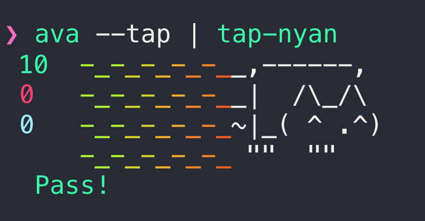

# [](https://ava.li)

> Futuristic test runner

[](https://travis-ci.org/avajs/ava) [](https://ci.appveyor.com/project/ava/ava/branch/master) [](https://codecov.io/gh/avajs/ava/branch/master) [](https://github.com/xojs/xo) [](https://spectrum.chat/ava)
 [](https://github.com/sindresorhus/awesome-nodejs)

Even though JavaScript is single-threaded, IO in Node.js can happen in parallel due to its async nature. AVA takes advantage of this and runs your tests concurrently, which is especially beneficial for IO heavy tests. In addition, test files are run in parallel as separate processes, giving you even better performance and an isolated environment for each test file. [Switching](https://github.com/sindresorhus/pageres/commit/663be15acb3dd2eb0f71b1956ef28c2cd3fdeed0) from Mocha to AVA in Pageres brought the test time down from 31 to 11 seconds. Having tests run concurrently forces you to write atomic tests, meaning tests don't depend on global state or the state of other tests, which is a great thing!


*Read our [contributing guide](contributing.md) if you're looking to contribute (issues/PRs/etc).*

Follow the [AVA Twitter account](https://twitter.com/ava__js) for updates.

**This documentation covers the 1.0 beta releases, which use Babel 7. The last release that uses Babel 6 is [`v0.25.0`](https://github.com/avajs/ava/tree/v0.25.0).**

Translations: [Español](https://github.com/avajs/ava-docs/blob/master/es_ES/readme.md), [Français](https://github.com/avajs/ava-docs/blob/master/fr_FR/readme.md), [Italiano](https://github.com/avajs/ava-docs/blob/master/it_IT/readme.md), [日本語](https://github.com/avajs/ava-docs/blob/master/ja_JP/readme.md), [한국어](https://github.com/avajs/ava-docs/blob/master/ko_KR/readme.md), [Português](https://github.com/avajs/ava-docs/blob/master/pt_BR/readme.md), [Русский](https://github.com/avajs/ava-docs/blob/master/ru_RU/readme.md), [简体中文](https://github.com/avajs/ava-docs/blob/master/zh_CN/readme.md)


## Contents

- [Usage](#usage)
- [CLI Usage](#cli)
- [Debugging](#debugging)
- [Reporters](#reporters)
- [Configuration](#configuration)
- [Documentation](#documentation)
- [API](#api)
- [Assertions](#assertions)
- [Snapshot testing](#snapshot-testing)
- [Tips](#tips)
- [FAQ](#faq)
- [Recipes](#recipes)
- [Support](#support)
- [Related](#related)
- [Links](#links)
- [Team](#team)


## Why AVA?

- Minimal and fast
- Simple test syntax
- Runs tests concurrently
- Enforces writing atomic tests
- No implicit globals
- Includes TypeScript & Flow type definitions
- [Magic assert](#magic-assert)
- [Isolated environment for each test file](#process-isolation)
- [Write your tests using the latest JavaScript syntax](#latest-javascript-support)
- [Promise support](#promise-support)
- [Async function support](#async-function-support)
- [Observable support](#observable-support)
- [Enhanced assertion messages](#enhanced-assertion-messages)
- [Automatic parallel test runs in CI](#parallel-runs-in-ci)
- [TAP reporter](#tap-reporter)
- [Automatic migration from other test runners](https://github.com/avajs/ava-codemods#migrating-to-ava)


## Test syntax

```js
import test from 'ava';

test('arrays are equal', t => {
	t.deepEqual([1, 2], [1, 2]);
});
```

## Usage

### Add AVA to your project

To install and set up AVA, run:

```console
$ npx create-ava --next
```

Your `package.json` will then look like this:

```json
{
	"name": "awesome-package",
	"scripts": {
		"test": "ava"
	},
	"devDependencies": {
		"ava": "1.0.0-beta.4"
	}
}
```

Initialization will work with npm and Yarn, but running `npx` requires [`npm@5.2.0`](https://github.com/npm/npm/releases/tag/v5.2.0) or greater to be installed. Otherwise, you'll have to manually install `ava` and configure the `test` script in your `package.json` as per above:

```console
$ npm install --save-dev --save-exact ava@next
```

Or if you prefer using Yarn:

```console
$ yarn add ava@next --dev --exact
```

### Create your test file

Create a file named `test.js` in the project root directory:

```js
import test from 'ava';

test('foo', t => {
	t.pass();
});

test('bar', async t => {
	const bar = Promise.resolve('bar');

	t.is(await bar, 'bar');
});
```

### Run it

```console
$ npm test
```

### Watch it

```console
$ npm test -- --watch
```

AVA comes with an intelligent watch mode. [Learn more in its recipe](docs/recipes/watch-mode.md).

### Supported Node.js versions

AVA supports the latest release of any major version that [is supported by Node.js itself](https://github.com/nodejs/Release#release-schedule). Read more in our [support statement](docs/support-statement.md).

## CLI

```console
$ ava --help

  Usage
    ava [<file|directory|glob> ...]

  Options
    --watch, -w             Re-run tests when tests and source files change
    --match, -m             Only run tests with matching title (Can be repeated)
    --update-snapshots, -u  Update snapshots
    --fail-fast             Stop after first test failure
    --timeout, -T           Set global timeout
    --serial, -s            Run tests serially
    --concurrency, -c       Max number of test files running at the same time (Default: CPU cores)
    --verbose, -v           Enable verbose output
    --tap, -t               Generate TAP output
    --color                 Force color output
    --no-color              Disable color output
    --reset-cache           Reset AVA's compilation cache and exit

  Examples
    ava
    ava test.js test2.js
    ava test-*.js
    ava test

  Default patterns when no arguments:
  test.js test-*.js test/**/*.js **/__tests__/**/*.js **/*.test.js
```

*Note that the CLI will use your local install of AVA when available, even when run globally.*

Directories are recursed, with all `*.js` files being treated as test files. Directories named `fixtures`, `helpers` and `node_modules` are *always* ignored. So are files starting with `_` which allows you to place helpers in the same directory as your test files.

When using `npm test`, you can pass positional arguments directly `npm test test2.js`, but flags needs to be passed like `npm test -- --verbose`.


## Debugging

AVA runs tests in child processes, so to debug tests, you need to do this workaround:

```console
$ node --inspect node_modules/ava/profile.js some/test/file.js
```

### Debugger-specific tips

- [Chrome DevTools](docs/recipes/debugging-with-chrome-devtools.md)
- [WebStorm](docs/recipes/debugging-with-webstorm.md)
- [Visual Studio Code](docs/recipes/debugging-with-vscode.md)


## Reporters

### Mini-reporter

The mini-reporter is the default reporter.


### Verbose reporter

Use the `--verbose` flag to enable the verbose reporter. This is always used in CI environments unless the [TAP reporter](#tap-reporter) is enabled.


### TAP reporter

AVA supports the TAP format and thus is compatible with [any TAP reporter](https://github.com/sindresorhus/awesome-tap#reporters). Use the `--tap` flag to enable TAP output.

```console
$ ava --tap | tap-nyan
```



Please note that the TAP reporter is unavailable when using [watch mode](#watch-it).

### Magic assert

AVA adds code excerpts and clean diffs for actual and expected values. If values in the assertion are objects or arrays, only a diff is displayed, to remove the noise and focus on the problem. The diff is syntax-highlighted too! If you are comparing strings, both single and multi line, AVA displays a different kind of output, highlighting the added or missing characters.


### Clean stack traces

AVA automatically removes unrelated lines in stack traces, allowing you to find the source of an error much faster, as seen above.


## Configuration

All of the CLI options can be configured in the `ava` section of either your `package.json` or an `ava.config.js` file. This allows you to modify the default behavior of the `ava` command, so you don't have to repeatedly type the same options on the command prompt.

To ignore a file or directory, prefix the pattern with an `!` (exclamation mark).

```json
{
	"ava": {
		"files": [
			"my-test-directory/**/*.js",
			"!my-test-directory/exclude-this-directory/**/*.js",
			"!**/exclude-this-file.js"
		],
		"sources": [
			"**/*.{js,jsx}",
			"!dist/**/*"
		],
		"match": [
			"*oo",
			"!foo"
		],
		"cache": true,
		"concurrency": 5,
		"failFast": true,
		"failWithoutAssertions": false,
		"tap": true,
		"verbose": true,
		"compileEnhancements": false,
		"require": [
			"@babel/register"
		],
		"babel": {
			"extensions": ["jsx"],
			"testOptions": {
				"babelrc": false
			}
		}
	}
}
```

Arguments passed to the CLI will always take precedence over the configuration in `package.json`.

### Options

- `files`: file & directory paths and glob patterns that select which files AVA will run tests from. Files with an underscore prefix are ignored. All matched files in selected directories are run. By default only selects files with `js` extensions, even if the glob pattern matches other files. Specify `extensions` and `babel.extensions` to allow other file extensions
- `source`: files that, when changed, cause tests to be re-run in watch mode. See the [watch mode recipe for details](https://github.com/avajs/ava/blob/master/docs/recipes/watch-mode.md#source-files-and-test-files)
- `match`: not typically useful in the `package.json` configuration, but equivalent to [specifying `--match` on the CLI](#running-tests-with-matching-titles)
- `cache`: cache compiled test and helper files under `node_modules/.cache/ava`. If `false`, files are cached in a temporary directory instead
- `failFast`: stop running further tests once a test fails
- `failWithoutAssertions`: if `false`, does not fail a test if it doesn't run [assertions](#assertions)
- `tap`: if `true`, enables the [TAP reporter](#tap-reporter)
- `verbose`: if `true`, enables verbose output
- `snapshotDir`: specifies a fixed location for storing snapshot files. Use this if your snapshots are ending up in the wrong location
- `compileEnhancements`: if `false`, disables [power-assert](https://github.com/power-assert-js/power-assert) — which otherwise helps provide more descriptive error messages — and detection of improper use of the `t.throws()` assertion
- `extensions`: extensions of test files that are not precompiled using AVA's Babel presets. Note that files are still compiled to enable power-assert and other features, so you may also need to set `compileEnhancements` to `false` if your files are not valid JavaScript. Setting this overrides the default `"js"` value, so make sure to include that extension in the list, as long as it's not included in `babel.extensions`
- `require`: extra modules to require before tests are run. Modules are required in the [worker processes](#process-isolation)
- `babel`: test file specific Babel options. See our [Babel recipe] for more details
- `babel.extensions`: extensions of test files that will be precompiled using AVA's Babel presets. Setting this overrides the default `"js"` value, so make sure to include that extension in the list

Note that providing files on the CLI overrides the `files` option. If you've configured a glob pattern, for instance `test/**/*.test.js`, you may want to repeat it when using the CLI: `ava 'test/integration/*.test.js'`.

### Using `ava.config.js`

To use an `ava.config.js` file:

 1. It must be in the same directory as your `package.json`
 2. Your `package.json` must not contain an `ava` property (or, if it does, it must be an empty object)

The config file must have a default export, using ES modules. It can either be a plain object or a factory function which returns a plain object:

```js
export default {
	require: ['esm']
};
```

```js
export default function factory() {
	return {
		require: ['esm']
	};
};
```

The factory function is called with an object containing a `projectDir` property, which you could use to change the returned configuration:

```js
export default ({projectDir}) => {
	if (projectDir === '/Users/username/projects/my-project') {
		return {
			// Config A
		};
	}

	return {
		// Config B
	};
};
```

Note that the final configuration must not be a promise.

### Resetting AVA's cache

AVA will automatically detect changes to test and helper files and recompile them. However, AVA is unable to detect changes to your Babel plugins and presets. If you update your Babel configuration, you can run AVA with the `--reset-cache` flag to reset AVA's cache. If set, all files in the `node_modules/.cache/ava` directory are deleted. Run AVA as normal to apply your new Babel configuration.

## Documentation

Tests are run concurrently. You can specify synchronous and asynchronous tests. Tests are considered synchronous unless you return a promise or [observable](https://github.com/zenparsing/zen-observable).

We *highly* recommend the use of [async functions](#async-function-support). They make asynchronous code concise and readable, and they implicitly return a promise so you don't have to.

If you're unable to use promises or observables, you may enable "callback mode" by defining your test with `test.cb([title], fn)`. Tests declared this way **must** be manually ended with `t.end()`. This mode is mainly intended for testing callback-style APIs. However, we would strongly recommend [promisifying](https://github.com/sindresorhus/pify) callback-style APIs instead of using "callback mode", as this results in more correct and readable tests.

You must define all tests synchronously. They can't be defined inside `setTimeout`, `setImmediate`, etc.

AVA tries to run test files with their current working directory set to the directory that contains your `package.json` file.

### Creating tests

To create a test you call the `test` function you imported from AVA. Provide the required title and implementation function. Titles must be unique within each test file. The function will be called when your test is run. It's passed an [execution object](#t) as its first argument.

**Note:** In order for the [enhanced assertion messages](#enhanced-assertion-messages) to behave correctly, the first argument **must** be named `t`.

```js
import test from 'ava';

test('my passing test', t => {
	t.pass();
});
```

### Assertion planning

Assertion plans ensure tests only pass when a specific number of assertions have been executed. They'll help you catch cases where tests exit too early. They'll also cause tests to fail if too many assertions are executed, which can be useful if you have assertions inside callbacks or loops.

If you do not specify an assertion plan, your test will still fail if no assertions are executed. Set the `failWithoutAssertions` option to `false` in AVA's [`package.json` configuration](#configuration) to disable this behavior.

Note that, unlike [`tap`](https://www.npmjs.com/package/tap) and [`tape`](https://www.npmjs.com/package/tape), AVA does *not* automatically end a test when the planned assertion count is reached.

These examples will result in a passed test:

```js
test('resolves with 3', t => {
	t.plan(1);

	return Promise.resolve(3).then(n => {
		t.is(n, 3);
	});
});

test.cb('invokes callback', t => {
	t.plan(1);

	someAsyncFunction(() => {
		t.pass();
		t.end();
	});
});
```

These won't:

```js
test('loops twice', t => {
	t.plan(2);

	for (let i = 0; i < 3; i++) {
		t.true(i < 3);
	}
}); // Fails, 3 assertions are executed which is too many

test('invokes callback synchronously', t => {
	t.plan(1);

	someAsyncFunction(() => {
		t.pass();
	});
}); // Fails, the test ends synchronously before the assertion is executed
```

### Running tests serially

Tests are run concurrently by default, however, sometimes you have to write tests that cannot run concurrently. In these rare cases you can use the `.serial` modifier. It will force those tests to run serially *before* the concurrent ones.

```js
test.serial('passes serially', t => {
	t.pass();
});
```

Note that this only applies to tests within a particular test file. AVA will still run multiple tests files at the same time unless you pass the [`--serial` CLI flag](#cli).

You can use the `.serial` modifier with all tests, hooks and even `.todo()`, but it's only available on the `test` function.

### Running specific tests

During development it can be helpful to only run a few specific tests. This can be accomplished using the `.only` modifier:

```js
test('will not be run', t => {
	t.fail();
});

test.only('will be run', t => {
	t.pass();
});
```

You can use the `.only` modifier with all tests. It cannot be used with hooks or `.todo()`.

*Note:* The `.only` modifier applies to the test file it's defined in, so if you run multiple test files, tests in other files will still run. If you want to only run the `test.only` test, provide just that test file to AVA.

### Running tests with matching titles

The `--match` flag allows you to run just the tests that have a matching title. This is achieved with simple wildcard patterns. Patterns are case insensitive. See [`matcher`](https://github.com/sindresorhus/matcher) for more details.

Match titles ending with `foo`:

```console
$ ava --match='*foo'
```

Match titles starting with `foo`:

```console
$ ava --match='foo*'
```

Match titles containing `foo`:

```console
$ ava --match='*foo*'
```

Match titles that are *exactly* `foo` (albeit case insensitively):

```console
$ ava --match='foo'
```

Match titles not containing `foo`:

```console
$ ava --match='!*foo*'
```

Match titles starting with `foo` and ending with `bar`:

```console
$ ava --match='foo*bar'
```

Match titles starting with `foo` or ending with `bar`:

```console
$ ava --match='foo*' --match='*bar'
```

Note that a match pattern takes precedence over the `.only` modifier. Only tests with an explicit title are matched. Tests without titles or whose title is derived from the implementation function will be skipped when `--match` is used.

Here's what happens when you run AVA with a match pattern of `*oo*` and the following tests:

```js
test('foo will run', t => {
	t.pass();
});

test('moo will also run', t => {
	t.pass();
});

test.only('boo will run but not exclusively', t => {
	t.pass();
});

// Won't run, no title
test(function (t) {
	t.fail();
});

// Won't run, no explicit title
test(function foo(t) {
	t.fail();
});
```

### Skipping tests

Sometimes failing tests can be hard to fix. You can tell AVA to skip these tests using the `.skip` modifier. They'll still be shown in the output (as having been skipped) but are never run.

```js
test.skip('will not be run', t => {
	t.fail();
});
```

You must specify the implementation function. You can use the `.skip` modifier with all tests and hooks, but not with `.todo()`. You can not apply further modifiers to `.skip`.

### Test placeholders ("todo")

You can use the `.todo` modifier when you're planning to write a test. Like skipped tests these placeholders are shown in the output. They only require a title; you cannot specify the implementation function.

```js
test.todo('will think about writing this later');
```

You can signal that you need to write a serial test:

```js
test.serial.todo('will think about writing this later');
```

### Failing tests

You can use the `.failing` modifier to document issues with your code that need to be fixed. Failing tests are run just like normal ones, but they are expected to fail, and will not break your build when they do. If a test marked as failing actually passes, it will be reported as an error and fail the build with a helpful message instructing you to remove the `.failing` modifier.

This allows you to merge `.failing` tests before a fix is implemented without breaking CI. This is a great way to recognize good bug report PR's with a commit credit, even if the reporter is unable to actually fix the problem.

```js
// See: github.com/user/repo/issues/1234
test.failing('demonstrate some bug', t => {
	t.fail(); // Test will count as passed
});
```

### Before & after hooks

AVA lets you register hooks that are run before and after your tests. This allows you to run setup and/or teardown code.

`test.before()` registers a hook to be run before the first test in your test file. Similarly `test.after()` registers a hook to be run after the last test. Use `test.after.always()` to register a hook that will **always** run once your tests and other hooks complete. `.always()` hooks run regardless of whether there were earlier failures, so they are ideal for cleanup tasks. Note however that uncaught exceptions, unhandled rejections or timeouts will crash your tests, possibly preventing `.always()` hooks from running.

`test.beforeEach()` registers a hook to be run before each test in your test file. Similarly `test.afterEach()` a hook to be run after each test. Use `test.afterEach.always()` to register an after hook that is called even if other test hooks, or the test itself, fail.

If a test is skipped with the `.skip` modifier, the respective `.beforeEach()`, `.afterEach()` and `.afterEach.always()` hooks are not run. Likewise, if all tests in a test file are skipped `.before()`, `.after()` and `.after.always()` hooks for the file are not run.

Like `test()` these methods take an optional title and an implementation function. The title is shown if your hook fails to execute. The implementation is called with an [execution object](#t). You can use assertions in your hooks. You can also pass a [macro function](#test-macros) and additional arguments.

`.before()` hooks execute before `.beforeEach()` hooks. `.afterEach()` hooks execute before `.after()` hooks. Within their category the hooks execute in the order they were defined. By default hooks execute concurrently, but you can use `test.serial` to ensure only that single hook is run at a time. Unlike with tests, serial hooks are *not* run before other hooks:

```js
test.before(t => {
	// This runs before all tests
});

test.before(t => {
	// This runs concurrently with the above
});

test.serial.before(t => {
	// This runs after the above
});

test.serial.before(t => {
	// This too runs after the above, and before tests
});

test.after('cleanup', t => {
	// This runs after all tests
});

test.after.always('guaranteed cleanup', t => {
	// This will always run, regardless of earlier failures
});

test.beforeEach(t => {
	// This runs before each test
});

test.afterEach(t => {
	// This runs after each test
});

test.afterEach.always(t => {
	// This runs after each test and other test hooks, even if they failed
});

test('title', t => {
	// Regular test
});
```

Hooks can be synchronous or asynchronous, just like tests. To make a hook asynchronous return a promise or observable, use an async function, or enable callback mode via `test.before.cb()`, `test.beforeEach.cb()` etc.

```js
test.before(async t => {
	await promiseFn();
});

test.after(t => {
	return new Promise(/* ... */);
});

test.beforeEach.cb(t => {
	setTimeout(t.end);
});

test.afterEach.cb(t => {
	setTimeout(t.end);
});
```

Keep in mind that the `.beforeEach()` and `.afterEach()` hooks run just before and after a test is run, and that by default tests run concurrently. This means each multiple `.beforeEach()` hooks may run concurrently. Using `test.serial.beforeEach()` does not change this. If you need to set up global state for each test (like spying on `console.log` [for example](https://github.com/avajs/ava/issues/560)), you'll need to make sure the tests themselves are [run serially](#running-tests-serially).

Remember that AVA runs each test file in its own process. You may not have to clean up global state in a `.after()`-hook since that's only called right before the process exits.

#### Test context

Hooks can share context with the test:

```js
test.beforeEach(t => {
	t.context.data = generateUniqueData();
});

test('context data is foo', t => {
	t.is(t.context.data + 'bar', 'foobar');
});
```

Context created in `.before()` hooks is [cloned](https://www.npmjs.com/package/lodash.clone) before it is passed to `.beforeEach()` hooks and / or tests. The `.after()` and `.after.always()` hooks receive the original context value.

For `.beforeEach()`, `.afterEach()` and `.afterEach.always()` hooks the context is *not* shared between different tests, allowing you to set up data such that it will not leak to other tests.

By default `t.context` is an object but you can reassign it:

```js
test.before(t => {
	t.context = 'unicorn';
});

test('context is unicorn', t => {
	t.is(t.context, 'unicorn');
});
```

### Test macros

Additional arguments passed to the test declaration will be passed to the test implementation. This is useful for creating reusable test macros.

```js
function macro(t, input, expected) {
	t.is(eval(input), expected);
}

test('2 + 2 = 4', macro, '2 + 2', 4);
test('2 * 3 = 6', macro, '2 * 3', 6);
```

You can build the test title programmatically by attaching a `title` function to the macro:

```js
function macro(t, input, expected) {
	t.is(eval(input), expected);
}

macro.title = (providedTitle, input, expected) => `${providedTitle} ${input} = ${expected}`.trim();

test(macro, '2 + 2', 4);
test(macro, '2 * 3', 6);
test('providedTitle', macro, '3 * 3', 9);
```

The `providedTitle` argument defaults to an empty string if the user does not supply a string title. This allows for easy concatenation without having to worry about `null` / `undefined`. It is worth remembering that the empty string is considered a falsy value, so you can still use `if(providedTitle) {...}`.

You can also pass arrays of macro functions:

```js
const safeEval = require('safe-eval');

function evalMacro(t, input, expected) {
	t.is(eval(input), expected);
}

function safeEvalMacro(t, input, expected) {
	t.is(safeEval(input), expected);
}

test([evalMacro, safeEvalMacro], '2 + 2', 4);
test([evalMacro, safeEvalMacro], '2 * 3', 6);
```

We encourage you to use macros instead of building your own test generators ([here is an example](https://github.com/avajs/ava-codemods/blob/47073b5b58aa6f3fb24f98757be5d3f56218d160/test/ok-to-truthy.js#L7-L9) of code that should be replaced with a macro). Macros are designed to perform static analysis of your code, which can lead to better performance, IDE integration, and linter rules.

### Custom assertions

You can use any assertion library instead of or in addition to the built-in one, provided it throws exceptions when the assertion fails.

This won't give you as nice an experience as you'd get with the [built-in assertions](#assertions) though, and you won't be able to use the [assertion planning](#assertion-planning) ([see #25](https://github.com/avajs/ava/issues/25)).

You'll have to configure AVA to not fail tests if no assertions are executed, because AVA can't tell if custom assertions pass. Set the `failWithoutAssertions` option to `false` in AVA's [`package.json` configuration](#configuration).

```js
import assert from 'assert';

test('custom assertion', t => {
	assert(true);
});
```

### Latest JavaScript support

AVA uses [Babel 7](https://babeljs.io) so you can use the latest JavaScript syntax in your tests. There is no extra setup required. You don't need to be using Babel in your own project for this to work either.

We aim support all [finished syntax proposals](https://github.com/tc39/proposals/blob/master/finished-proposals.md), as well as all syntax from ratified JavaScript versions (e.g. ES2017). See our [`@ava/stage-4`](https://github.com/avajs/babel-preset-stage-4) preset for the currently supported proposals.

Please note that we do not add or modify built-ins. For example, if you use [`Object.entries()`](https://github.com/tc39/proposal-object-values-entries) in your tests, they will crash in Node.js 6 which does not implement this method.

You can disable this syntax support, or otherwise customize AVA's Babel pipeline. See our [Babel recipe] for more details.

### TypeScript support

AVA includes typings for TypeScript. You have to set up transpilation yourself. When you set `module` to `commonjs` in your `tsconfig.json` file, TypeScript will automatically find the type definitions for AVA. You should set `target` to `es2015` to use promises and async functions.

See AVA's [TypeScript recipe](docs/recipes/typescript.md) for a more detailed explanation.

### Transpiling imported modules

AVA currently only transpiles the tests you ask it to run, as well as test helpers (files starting with `_` or in `helpers` directory) inside the test directory. *It will not transpile modules you `import` from outside of the test.* This may be unexpected but there are workarounds.

If you use Babel you can use its [require hook](https://babeljs.io/docs/usage/require/) to transpile imported modules on-the-fly. To add it, [configure it in your `package.json`](#configuration).

You can also transpile your modules in a separate process and refer to the transpiled files rather than the sources from your tests. Example [here](docs/recipes/precompiling-with-webpack.md).

### Promise support

If you return a promise in the test you don't need to explicitly end the test as it will end when the promise resolves.

```js
test('resolves with unicorn', t => {
	return somePromise().then(result => {
		t.is(result, 'unicorn');
	});
});
```

### Async function support

AVA comes with built-in support for [async functions](https://tc39.github.io/ecmascript-asyncawait/) *(async/await)*.

```js
test(async function (t) {
	const value = await promiseFn();
	t.true(value);
});

// Async arrow function
test('promises the truth', async t => {
	const value = await promiseFn();
	t.true(value);
});
```

### Observable support

AVA comes with built-in support for [observables](https://github.com/zenparsing/es-observable). If you return an observable from a test, AVA will automatically consume it to completion before ending the test.

*You do not need to use "callback mode" or call `t.end()`.*

```js
test('handles observables', t => {
	t.plan(3);
	return Observable.of(1, 2, 3, 4, 5, 6)
		.filter(n => {
			// Only even numbers
			return n % 2 === 0;
		})
		.map(() => t.pass());
});
```

### Callback support

AVA supports using `t.end` as the final callback when using node-style error-first callback APIs. AVA will consider any truthy value passed as the first argument to `t.end` to be an error. Note that `t.end` requires "callback mode", which can be enabled by using the `test.cb` chain.

```js
test.cb('data.txt can be read', t => {
	// `t.end` automatically checks for error as first argument
	fs.readFile('data.txt', t.end);
});
```

### Global timeout

A global timeout can be set via the `--timeout` option. Timeout in AVA behaves differently than in other test frameworks. AVA resets a timer after each test, forcing tests to quit if no new test results were received within the specified timeout. This can be used to handle stalled tests.

You can set timeouts in a human-readable way:

```console
$ ava --timeout=10s # 10 seconds
$ ava --timeout=2m # 2 minutes
$ ava --timeout=100 # 100 milliseconds
```

### Parallel runs in CI

AVA automatically detects whether your CI environment supports parallel builds. Each build will run a subset of all test files, while still making sure all tests get executed. See the [`ci-parallel-vars`](https://www.npmjs.com/package/ci-parallel-vars) package for a list of supported CI environments.

## API

### `test([title], implementation)`
### `test.serial([title], implementation)`
### `test.cb([title], implementation)`
### `test.only([title], implementation)`
### `test.skip([title], implementation)`
### `test.todo(title)`
### `test.failing([title], implementation)`
### `test.before([title], implementation)`
### `test.after([title], implementation)`
### `test.beforeEach([title], implementation)`
### `test.afterEach([title], implementation)`

#### `title`

Type: `string`

Test title.

#### `implementation(t)`

Type: `function`

Should contain the actual test.

##### `t`

Type: `object`

The execution object of a particular test. Each test implementation receives a different object. Contains the [assertions](#assertions) as well as `.plan(count)` and `.end()` methods. `t.context` can contain shared state from hooks. `t.title` returns the test's title.

###### `t.plan(count)`

Plan how many assertion there are in the test. The test will fail if the actual assertion count doesn't match the number of planned assertions. See [assertion planning](#assertion-planning).

###### `t.end()`

End the test. Only works with `test.cb()`.

###### `t.log(...values)`

Log values contextually alongside the test result instead of immediately printing them to `stdout`. Behaves somewhat like `console.log`, but without support for placeholder tokens.

## Assertions

Assertions are mixed into the [execution object](#t) provided to each test implementation:

```js
test('unicorns are truthy', t => {
	t.truthy('unicorn'); // Assertion
});
```

Assertions are bound to their test so you can assign them to a variable or pass them around:

```js
test('unicorns are truthy', t => {
	const truthy = t.truthy;
	truthy('unicorn');
});
```

Assertions can be skipped by adding `.skip()`:

```js
test('unicorns are truthy', t => {
	t.truthy.skip('unicorn');
});
```

If multiple assertion failures are encountered within a single test, AVA will only display the *first* one.

### `.pass([message])`

Passing assertion.

### `.fail([message])`

Failing assertion.

### `.truthy(value, [message])`

Assert that `value` is truthy.

### `.falsy(value, [message])`

Assert that `value` is falsy.

### `.true(value, [message])`

Assert that `value` is `true`.

### `.false(value, [message])`

Assert that `value` is `false`.

### `.is(value, expected, [message])`

Assert that `value` is the same as `expected`. This is based on [`Object.is()`](https://developer.mozilla.org/en-US/docs/Web/JavaScript/Reference/Global_Objects/Object/is).

### `.not(value, expected, [message])`

Assert that `value` is not the same as `expected`. This is based on [`Object.is()`](https://developer.mozilla.org/en-US/docs/Web/JavaScript/Reference/Global_Objects/Object/is).

### `.deepEqual(value, expected, [message])`

Assert that `value` is deeply equal to `expected`. See [Concordance](https://github.com/concordancejs/concordance) for details. Works with [React elements and `react-test-renderer`](https://github.com/concordancejs/react).

### `.notDeepEqual(value, expected, [message])`

Assert that `value` is not deeply equal to `expected`. The inverse of `.deepEqual()`.

### `.throws(fn, [expected, [message]])`

Assert that an error is thrown. `fn` must be a function which should throw. The thrown value *must* be an error. It is returned so you can run more assertions against it.

`expected` can be a constructor, in which case the thrown error must be an instance of the constructor. It can be a string, which is compared against the thrown error's message, or a regular expression which is matched against this message. You can also specify a matcher object with one or more of the following properties:

* `instanceOf`: a constructor, the thrown error must be an instance of
* `is`: the thrown error must be strictly equal to `expected.is`
* `message`: either a string, which is compared against the thrown error's message, or a regular expression, which is matched against this message
* `name`: the expected `.name` value of the thrown error
* `code`: the expected `.code` value of the thrown error

`expected` does not need to be specified. If you don't need it but do want to set an assertion message you have to specify `null`.

Example:

```js
const fn = () => {
	throw new TypeError('🦄');
};

test('throws', t => {
	const error = t.throws(() => {
		fn();
	}, TypeError);

	t.is(error.message, '🦄');
});
```

### `.throwsAsync(thrower, [expected, [message]])`

Assert that an error is thrown. `thrower` can be an async function which should throw, or a promise that should reject. This assertion must be awaited.

The thrown value *must* be an error. It is returned so you can run more assertions against it.

`expected` can be a constructor, in which case the thrown error must be an instance of the constructor. It can be a string, which is compared against the thrown error's message, or a regular expression which is matched against this message. You can also specify a matcher object with one or more of the following properties:

* `instanceOf`: a constructor, the thrown error must be an instance of
* `is`: the thrown error must be strictly equal to `expected.is`
* `message`: either a string, which is compared against the thrown error's message, or a regular expression, which is matched against this message
* `name`: the expected `.name` value of the thrown error
* `code`: the expected `.code` value of the thrown error

`expected` does not need to be specified. If you don't need it but do want to set an assertion message you have to specify `null`.

Example:

```js
test('throws', async t => {
	await t.throwsAsync(async () => {
		throw new TypeError('🦄');
	}, {instanceOf: TypeError, message: '🦄'});
});
```

```js
const promise = Promise.reject(new TypeError('🦄'));

test('rejects', async t => {
	const error = await t.throwsAsync(promise);
	t.is(error.message, '🦄');
});
```

### `.notThrows(fn, [message])`

Assert that no error is thrown. `fn` must be a function which shouldn't throw.

### `.notThrowsAsync(nonThrower, [message])`

Assert that no error is thrown. `nonThrower` can be an async function which shouldn't throw, or a promise that should resolve.

Like the `.throwsAsync()` assertion, you must wait for the assertion to complete:

```js
test('resolves', async t => {
	await t.notThrowsAsync(promise);
});
```

### `.regex(contents, regex, [message])`

Assert that `contents` matches `regex`.

### `.notRegex(contents, regex, [message])`

Assert that `contents` does not match `regex`.

### `.snapshot(expected, [message])`
### `.snapshot(expected, [options], [message])`

Compares the `expected` value with a previously recorded snapshot. Snapshots are stored for each test, so ensure you give your tests unique titles. Alternatively pass an `options` object to select a specific snapshot, for instance `{id: 'my snapshot'}`.

Snapshot assertions cannot be skipped when snapshots are being updated.

## Snapshot testing

AVA supports snapshot testing, [as introduced by Jest](https://facebook.github.io/jest/docs/snapshot-testing.html), through its [Assertions](#assertions) interface. You can snapshot any value as well as React elements:

```js
// Your component
const HelloWorld = () => <h1>Hello World...!</h1>;

export default HelloWorld;
```

```js
// Your test
import test from 'ava';
import render from 'react-test-renderer';
import HelloWorld from '.';

test('HelloWorld component', t => {
	const tree = render.create(<HelloWorld/>).toJSON();
	t.snapshot(tree);
});
```

[Try it out in this example project.](https://github.com/avajs/ava-snapshot-example)

Snapshots are stored alongside your test files. If your tests are in a `test` or `tests` folder the snapshots will be stored in a `snapshots` folder. If your tests are in a `__tests__` folder then they they'll be stored in a `__snapshots__` folder.

Say you have `~/project/test/main.js` which contains snapshot assertions. AVA will create two files:

* `~/project/test/snapshots/main.js.snap`
* `~/project/test/snapshots/main.js.md`

The first file contains the actual snapshot and is required for future comparisons. The second file contains your *snapshot report*. It's regenerated when you update your snapshots. If you commit it to source control you can diff it to see the changes to your snapshot.

AVA will show why your snapshot assertion failed:


You can then check your code. If the change was intentional you can use the `--update-snapshots` (or `-u`) flag to update the snapshots:

```console
$ ava --update-snapshots
```

You can specify a fixed location for storing the snapshot files in AVA's [`package.json` configuration](#configuration):

```json
{
	"ava": {
		"snapshotDir": "custom-directory"
	}
}
```

The snapshot files will be saved in a directory structure that mirrors that of your test files.

If you are running AVA against precompiled test files, AVA will try and use source maps to determine the location of the original files. Snapshots will be stored next to these files, following the same rules as if AVA had executed the original files directly. This is great if you're writing your tests in TypeScript (see our [TypeScript recipe](docs/recipes/typescript.md)).

### Skipping assertions

Any assertion can be skipped using the `skip` modifier. Skipped assertions are still counted, so there is no need to change your planned assertion count.

```js
test('skip assertion', t => {
	t.plan(2);
	t.is.skip(foo(), 5); // No need to change your plan count when skipping
	t.is(1, 1);
});
```

### Enhanced assertion messages

AVA comes with [`power-assert`](https://github.com/power-assert-js/power-assert) built-in, giving you more descriptive assertion messages. It reads your test and tries to infer more information from the code.

Let's take this example, using Node's standard [`assert` library](https://nodejs.org/api/assert.html):

```js
const a = /foo/;
const b = 'bar';
const c = 'baz';
require('assert').ok(a.test(b) || b === c);
```

If you paste that into a Node REPL it'll return:

```
AssertionError: false == true
```

In AVA however, this test:

```js
test('enhanced assertions', t => {
	const a = /foo/;
	const b = 'bar';
	const c = 'baz';
	t.true(a.test(b) || b === c);
});
```

Will output:

```
t.true(a.test(b) || b === c)
       |      |     |     |
       |      "bar" "bar" "baz"
       false
```

## Process isolation

Each test file is run in a separate Node.js process. This allows you to change the global state or overriding a built-in in one test file, without affecting another. It's also great for performance on modern multi-core processors, allowing multiple test files to execute in parallel.

AVA will set `process.env.NODE_ENV` to `test`, unless the `NODE_ENV` environment variable has been set. This is useful if the code you're testing has test defaults (for example when picking what database to connect to, or environment-specific Babel options). It may cause your code or its dependencies to behave differently though. Note that `'NODE_ENV' in process.env` will always be `true`.

## Tips

### Temp files

Running tests concurrently comes with some challenges, doing file IO is one.

Usually, serial tests create temp directories in the current test directory and clean them up at the end. This won't work when you run tests concurrently as tests will conflict with each other. The correct way to do it is to use a new temp directory for each test. The [`tempfile`](https://github.com/sindresorhus/tempfile) and [`temp-write`](https://github.com/sindresorhus/temp-write) modules can be helpful.

### Code coverage

You can't use [`istanbul`](https://github.com/gotwarlost/istanbul) for code coverage as AVA [spawns the test files](#process-isolation). You can use [`nyc`](https://github.com/bcoe/nyc) instead, which is basically `istanbul` with support for subprocesses.

As of version `5.0.0` it uses source maps to report coverage for your actual code, regardless of transpilation. Make sure that the code you're testing includes an inline source map or references a source map file. If you use `@babel/register` you can set the `sourceMaps` option in your Babel config to `inline`.

### Common pitfalls

We have a growing list of [common pitfalls](docs/common-pitfalls.md) you may experience while using AVA. If you encounter any issues you think are common, comment in [this issue](https://github.com/avajs/ava/issues/404).

## FAQ

### Why not `mocha`, `tape`, `tap`?

Mocha requires you to use implicit globals like `describe` and `it` with the default interface (which most people use). It's not very opinionated and executes tests serially without process isolation, making it slow.

Tape and tap are pretty good. AVA is highly inspired by their syntax. They too execute tests serially. Their default [TAP](https://testanything.org) output isn't very user-friendly though so you always end up using an external tap reporter.

In contrast AVA is highly opinionated and runs tests concurrently, with a separate process for each test file. Its default reporter is easy on the eyes and yet AVA still supports TAP output through a CLI flag.

### How is the name written and pronounced?

AVA, not Ava or ava. Pronounced [/ˈeɪvə/ ay-və](media/pronunciation.m4a?raw=true).

### What is the header background?

It's the [Andromeda galaxy](https://simple.wikipedia.org/wiki/Andromeda_galaxy).

### What is the difference between concurrency and parallelism?

[Concurrency is not parallelism. It enables parallelism.](https://stackoverflow.com/q/1050222)

## Recipes

- [Test setup](docs/recipes/test-setup.md)
- [Code coverage](docs/recipes/code-coverage.md)
- [Watch mode](docs/recipes/watch-mode.md)
- [Endpoint testing](docs/recipes/endpoint-testing.md)
- [When to use `t.plan()`](docs/recipes/when-to-use-plan.md)
- [Browser testing](docs/recipes/browser-testing.md)
- [TypeScript](docs/recipes/typescript.md)
- [Flow](docs/recipes/flow.md)
- [Configuring Babel][Babel recipe]
- [Using ES modules](docs/recipes/es-modules.md)
- [Passing arguments to your test files](docs/recipes/passing-arguments-to-your-test-files.md)
- [Testing React components](docs/recipes/react.md)
- [Testing Vue.js components](docs/recipes/vue.md)
- [JSPM and SystemJS](docs/recipes/jspm-systemjs.md)
- [Debugging tests with Chrome DevTools](docs/recipes/debugging-with-chrome-devtools.md)
- [Debugging tests with WebStorm](docs/recipes/debugging-with-webstorm.md)
- [Precompiling source files with webpack](docs/recipes/precompiling-with-webpack.md)
- [Isolated MongoDB integration tests](docs/recipes/isolated-mongodb-integration-tests.md)

## Support

- [Stack Overflow](https://stackoverflow.com/questions/tagged/ava)
- [Spectrum](https://spectrum.chat/ava)
- [Twitter](https://twitter.com/ava__js)

## Related

- [eslint-plugin-ava](https://github.com/avajs/eslint-plugin-ava) - Lint rules for AVA tests
- [sublime-ava](https://github.com/avajs/sublime-ava) - Snippets for AVA tests
- [atom-ava](https://github.com/avajs/atom-ava) - Snippets for AVA tests
- [vscode-ava](https://github.com/samverschueren/vscode-ava) - Snippets for AVA tests
- [gulp-ava](https://github.com/avajs/gulp-ava) - Run tests with gulp
- [grunt-ava](https://github.com/avajs/grunt-ava) - Run tests with grunt
- [More…](https://github.com/avajs/awesome-ava#packages)

## Links

- [AVA stickers, t-shirts, etc](https://www.redbubble.com/people/sindresorhus/works/30330590-ava-logo)
- [Awesome list](https://github.com/avajs/awesome-ava)
- [AVA Casts](http://avacasts.com)
- [More…](https://github.com/avajs/awesome-ava)

## Team

[](https://github.com/novemberborn) | [](https://github.com/sindresorhus) | [](https://github.com/vadimdemedes)
---|---|---
[Mark Wubben](https://novemberborn.net) | [Sindre Sorhus](http://sindresorhus.com) | [Vadim Demedes](https://github.com/vadimdemedes)

###### Former

- [Kevin Mårtensson](https://github.com/kevva)
- [James Talmage](https://github.com/jamestalmage)
- [Juan Soto](https://github.com/sotojuan)
- [Jeroen Engels](https://github.com/jfmengels)


<div align="center">
	<br>
	<br>
	<br>
	<a href="https://ava.li">
		
	</a>
	<br>
	<br>
</div>

[Babel recipe]: docs/recipes/babel.md
