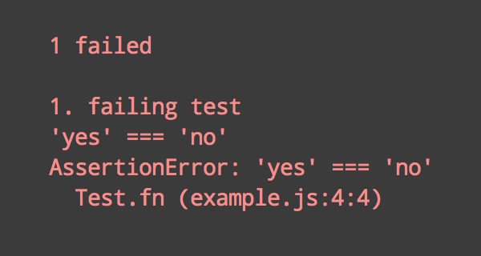

# 

> Futuristic test runner

[](https://travis-ci.org/sindresorhus/ava) [](https://ci.appveyor.com/project/sindresorhus/ava/branch/master) [](https://coveralls.io/github/sindresorhus/ava?branch=master) [](https://gitter.im/sindresorhus/ava)

Even though JavaScript is single-threaded, IO in Node.js can happen in parallel due to its async nature. AVA takes advantage of this and runs your tests concurrently, which is especially beneficial for IO heavy tests. In addition, test files are run in parallel as separate processes, giving you even better performance and an isolated environment for each test file. [Switching](https://github.com/sindresorhus/pageres/commit/663be15acb3dd2eb0f71b1956ef28c2cd3fdeed0) from Mocha to AVA in Pageres brought the test time down from 31 sec to 11 sec. Having tests run concurrently forces you to write atomic tests, meaning tests don't depend on global state or the state of other tests, which is a great thing!

*Read our [contributing guide](contributing.md) if you're looking to contribute (issues/PRs/etc).*

Translations: [Español](https://github.com/sindresorhus/ava-docs/blob/master/es_ES/readme.md), [Français](https://github.com/sindresorhus/ava-docs/blob/master/fr_FR/readme.md)


## Table of Contents

- [Usage](#usage)
- [CLI Usage](#cli)
- [Configuration](#configuration)
- [Documentation](#documentation)
- [API](#api)
- [Assertions](#assertions)
- [FAQ](#faq)
- [Recipes](#recipes)


## Why AVA?

- Minimal and fast
- Simple test syntax
- Runs tests concurrently
- Enforces writing atomic tests
- No implicit globals
- [Isolated environment for each test file](#isolated-environment)
- [Write your tests in ES2015](#es2015-support)
- [Promise support](#promise-support)
- [Generator function support](#generator-function-support)
- [Async function support](#async-function-support)
- [Observable support](#observable-support)
- [Enhanced asserts](#enhanced-asserts)
- [Optional TAP output](#optional-tap-output)
- [Clean stack traces](#clean-stack-traces)


## Test syntax

```js
import test from 'ava';

test(t => {
	t.same([1, 2], [1, 2]);
});
```


## Usage

#### Initialize

Install AVA globally `$ npm install --global ava` and run `$ ava --init` (with any options) to add AVA to your package.json or create one.

```json
{
	"name": "awesome-package",
	"scripts": {
		"test": "ava"
	},
	"devDependencies": {
		"ava": "^0.6.0"
	}
}
```

#### Create your test file

```js
import test from 'ava';
import delay from 'delay';

test('foo', t => {
	t.pass();
});

test('bar', async t => {
	t.plan(1);

	const bar = Promise.resolve('bar').then(delay(200));

	t.is(await bar, 'bar');
});
```


#### Run it

```
$ npm test
```


## CLI

```
$ ava --help

  Usage
    ava [<file|folder|glob> ...]

  Options
    --init       Add AVA to your project
    --fail-fast  Stop after first test failure
    --serial     Run tests serially
    --require    Module to preload (Can be repeated)
    --tap        Generate TAP output
    --verbose    Enable verbose output

  Examples
    ava
    ava test.js test2.js
    ava test-*.js
    ava test
    ava --init
    ava --init foo.js

  Default patterns when no arguments:
  test.js test-*.js test/**/*.js
```

Directories are recursive by default. Files in directories named `fixtures` and `helpers` are ignored, as well as files starting with `_`. This can be useful for having helpers in the same directory as your test files.

*WARNING: NON-STANDARD BEHAVIOR:* The AVA CLI will always try to find and use your projects local install of AVA. This is true even when you run the global `ava` command. This non-standard behavior solves an important [issue](https://github.com/sindresorhus/ava/issues/157), and should have no impact on everyday use.

## Configuration

All of the CLI options can be configured in the `ava` section of your `package.json`. This allows you to modify the default behavior of the `ava` command, so you don't have to repeatedly type the same options on the command prompt.

```json
{
  "ava": {
    "files": [
      "my-test-folder/*.js",
      "!**/not-this-file.js"
    ],
    "failFast": true,
    "serial": true,
    "tap": true,
    "verbose": true,
    "require": ["babel-core/register", "coffee-script/register"]
  }
}
```

Arguments passed to the CLI will always take precedence over the configuration in `package.json`.

## Documentation

Tests are run asynchronously and require you to return a supported async object (a promise, or [observable](https://github.com/zenparsing/zen-observable)). We *highly* recommend the use of [async functions](#async-function-support); They make async code concise and readable, and they implicitly return a promise, so you don't have to.

If you don't return one of the supported async objects mentioned above, the test is considered to be synchronous and ended immediately.

If you're unable to use promises or other supported async objects, you may enable "callback mode" by defining your test with `test.cb([title], fn)`. Tests declared this way **must** be manually ended with `t.end()`. This mode is mainly intended for testing callback-style APIs.

You must define all tests synchronously. They can't be defined inside `setTimeout`, `setImmediate`, etc.

Test files are run from their current directory, so [`process.cwd()`](https://nodejs.org/api/process.html#process_process_cwd) is always the same as [`__dirname`](https://nodejs.org/api/globals.html#globals_dirname). You can just use relative paths instead of doing `path.join(__dirname, 'relative/path')`.

### Test anatomy

To create a test, you call the `test` function you `require`d from AVA and pass in an optional test name and a function containing the test execution. The passed function is given the context as the first argument, where you can call the different AVA methods and [assertions](#assertions).

```js
test('name', t => {
	t.pass();
});
```

### Optional test name

Naming a test is optional, but you're recommended to use one if you have more than one test.

```js
test(t => {
	t.pass();
});
```

You can also choose to use a named function instead:

```js
test(function name(t) {
	t.pass();
});
```

### Assertion plan

An assertion plan can be used to ensure a specific number of assertions are made. In the most common scenario, it validates that the test didn't exit before executing the expected number of assertions. It also fails the test if too many assertions are executed, which can be useful if you have assertions inside callbacks or loops.

This will result in a passed test:

```js
test(t => {
	t.plan(1);

	return Promise.resolve(3).then(n => {
		t.is(n, 3);
	});
});

test.cb(t => {
	setTimeout(() => {
		t.pass();
		t.end();
	}, 100);
});
```

#### WARNING: Recent breaking change.

AVA no longer supports automatically ending tests via `t.plan(...)`. This helps prevent false positives if you add assertions, but forget to increase your plan count.

```js
// This no longer works

test('auto ending is dangerous', t => {
	t.plan(2);

	t.pass();
	t.pass();

	// auto-ending after reaching the planned two assertions will miss this final one
	setTimeout(() => t.fail(), 10000);
});
```

For this to work, you must now use "callback mode", and explicitly call `t.end()`.

```js
test.cb('explicitly end your tests', t => {
	t.plan(2);

	t.pass();
	t.pass();

	setTimeout(() => {
		// This failure is now reliably caught.
		t.fail();
		t.end();
	}, 1000);
});
```

### Serial-tests

While concurrency is awesome, there are some things that can't be done concurrently. In these rare cases, you can call `test.serial`, which will force those tests to run serially before the concurrent ones.

```js
test.serial(t => {
	t.pass();
});
```

### Only-tests

Only-tests enforces only those tests to be run. This can be useful for running only a few tests during development.

```js
test('will not be run', t => {
	t.fail();
})

test.only('will be run', t => {
	t.pass();
});
```

### Skip-tests

Skip-tests are shown in the output as skipped but never run.

```js
test.skip('will not be run', t => {
	t.fail();
});
```

### Before & after hooks

When setup and/or teardown is required, you can use `test.before()` and `test.after()`,
used in the same manner as `test()`. The test function given to `test.before()` and `test.after()` is called before/after all tests. You can also use `test.beforeEach()` and `test.afterEach()` if you need setup/teardown for each test. Hooks are run serially in the test file. Add as many of these as you want. You can optionally specify a title that is shown on failure.


```js
test.before(t => {
	// this runs before all tests
});

test.before(t => {
	// this runs after the above, but before tests
});

test.after('cleanup', t => {
	// this runs after all tests
});

test.beforeEach(t => {
	// this runs before each test
});

test.afterEach(t => {
	// this runs after each test
});

test(t => {
	// regular test
});
```

You may use async functions, return async objects, or enable "callback mode" in any of the hooks.

```js
test.before(async t => {
	await promiseFn();
});

test.cb.beforeEach(t => {
	setTimeout(t.end);
});

test.afterEach.cb(t => {
	setTimeout(t.end);
});

test.after(t => {
   return new Promise(/* ... */);
});
```

The `beforeEach` & `afterEach` hooks can share context with the test:

```js
test.beforeEach(t => {
	t.context.data = generateUniqueData();
});

test(t => {
	t.is(t.context.data + 'bar', 'foobar');
});
```

The context is by default an object, but it can also be directly assigned:

```js
test.beforeEach(t => {
	t.context = 'unicorn';
});

test(t => {
	t.is(t.context, 'unicorn');
});
```

### Chaining test modifiers

You can chain test modifiers together in the following ways:

```js
test.before.skip([title], testFn);
test.skip.after(....);
test.serial.only(...);
test.only.serial(...);
```

This is especially helpful temporarily using `skip` or `only` on a test, without losing the information and behavior the other modifiers provide.

### Custom assertion module

You can use any assertion module instead or in addition to the one that comes with AVA, but you won't be able to use the `.plan()` method, [yet](https://github.com/sindresorhus/ava/issues/25).

```js
import assert from 'assert';

test(t => {
	assert(true);
});
```

### ES2015 support

AVA comes with builtin support for ES2015 through [Babel 6](https://babeljs.io). Just write your tests in ES2015. No extra setup needed. You can use any Babel version in your project. We use our own bundled Babel with the [`es2015`](http://babeljs.io/docs/plugins/preset-es2015/) and [`stage-2`](http://babeljs.io/docs/plugins/preset-stage-2/) presets.

#### Transpiling Imported Modules

AVA currently only transpiles the tests you ask it to run. *It will not transpile modules you ```import``` from outside of the test.* While there are valid reasons for taking this approach, it may not be what you expect!

As a simple workaround, you can use [Babel's require hook](https://babeljs.io/docs/usage/require/) in order to do on-the-fly transpiling of modules that are subsequently imported. Because AVA supports ES2015 module syntax, you can use it to import the require hook itself:

```js
import test from 'ava';
import 'babel-core/register';
import foo from './foo'; // <-- foo can be written in ES2015!

test('foo bar', t => {
	t.same('baz', foo('bar'));
});
```

[#111](https://github.com/sindresorhus/ava/issues/111) is tracking this item as a potential enhancement.

### Promise support

If you return a promise in the test you don't need to explicitly end the test as it will end when the promise resolves.

```js
test(t => {
	return somePromise().then(result => {
		t.is(result, 'unicorn');
	});
});
```

### Generator function support

AVA comes with builtin support for [generator functions](https://developer.mozilla.org/en-US/docs/Web/JavaScript/Reference/Statements/function*).

```js
test(function * (t) {
	const value = yield generatorFn();
	t.true(value);
});
```

### Async function support

AVA comes with builtin support for [async functions](https://tc39.github.io/ecmascript-asyncawait/) *(async/await)*.

```js
test(async function (t) {
	const value = await promiseFn();
	t.true(value);
});

// async arrow function
test(async t => {
	const value = await promiseFn();
	t.true(value);
});
```

### Observable support

AVA comes with builtin support for [observables](https://github.com/zenparsing/es-observable).
If you return an observable from a test, AVA will automatically consume it to completion before ending the test.

*You do not need to use "callback mode" or call `t.end()`.*

```js
test(t => {
	t.plan(3);
	return Observable.of(1, 2, 3, 4, 5, 6)
		.filter(n => {
			// only even numbers
			return n % 2 === 0;
		})
		.map(() => t.pass());
});
```

### Callback support

AVA supports using `t.end` as the final callback when using node-style error-first callback APIs. AVA will consider any truthy value passed as the first argument to `t.end` to be an error. Note that `t.end` requires "callback mode", which can be enabled by using the `test.cb` chain.

```js
test.cb(t => {
	// t.end automatically checks for error as first argument
	fs.readFile('data.txt', t.end);
});
```

### Optional TAP output

AVA can generate TAP output via `--tap` option for use with any [TAP reporter](https://github.com/sindresorhus/awesome-tap#reporters).

```
$ ava --tap | tap-nyan
```


### Clean stack traces

AVA automatically removes unrelated lines in stack traces, allowing you to find the source of an error much faster.




## API

### test([title], body)
### test.serial([title], body)
### test.cb([title], body)
### test.only([title], body)
### test.skip([title], body)
### test.before([title], body)
### test.after([title], body)
### test.beforeEach([title], body)
### test.afterEach([title], body)

#### title

Type: `string`

Test title.

#### body(context)

Type: `function`

Should contain the actual test.

##### context

Passed into the test function and contains the different AVA methods and [assertions](#assertions).

###### .plan(count)

Plan how many assertion there are in the test. The test will fail if the actual assertion count doesn't match planned assertions.

###### .end()

End the test. Only works with `test.cb()`.


## Assertions

Assertions are mixed into the test [context](#context):

```js
test(t => {
	t.ok('unicorn'); // assertion
});
```

If multiple assertion failures are encountered within a single test, AVA will only display the *first* one.

### .pass([message])

Passing assertion.

### .fail([message])

Failing assertion.

### .ok(value, [message])

Assert that `value` is truthy.

### .notOk(value, [message])

Assert that `value` is falsy.

### .true(value, [message])

Assert that `value` is `true`.

### .false(value, [message])

Assert that `value` is `false`.

### .is(value, expected, [message])

Assert that `value` is equal to `expected`.

### .not(value, expected, [message])

Assert that `value` is not equal to `expected`.

### .same(value, expected, [message])

Assert that `value` is deep equal to `expected`.

### .notSame(value, expected, [message])

Assert that `value` is not deep equal to `expected`.

### .throws(function|promise, error, [message])

Assert that `function` throws an error or `promise` rejects.

`error` can be a constructor, regex, error message or validation function.

### .doesNotThrow(function|promise, [message])

Assert that `function` doesn't throw an `error` or `promise` resolves.

### .ifError(error, [message])

Assert that `error` is falsy.

## Skipping Assertions

Any assertion can be skipped using the `skip` modifier. Skipped assertions are still counted, so there is no need to change your planned assertion count.

```js
test(t => {
  t.plan(2);
  t.skip.is(foo(), 5); // no need to change your plan count when skipping.
  t.is(1, 1);
});
```

## Enhanced asserts

AVA comes with [`power-assert`](https://github.com/power-assert-js/power-assert) builtin, giving you more descriptive assertion messages. It reads your test and tries to infer more information from the code.

The following test:

```js
test(t => {
	const x = 'foo';
	t.ok(x === 'bar');
});
```

Would normally give the unhelpful output:

```
false === true
```

With the enhanced asserts, you'll get:

```
t.ok(x === 'bar')
     |
     "foo"
```

True, you could use `t.is()` in this case, and probably should, but this is just a simple example.

Let try a more advanced example:

```js
test(t => {
	const a = /foo/;
	const b = 'bar';
	const c = 'baz';
	t.ok(a.test(b) || b === c);
});
```

And there you go:

```
t.ok(a.test(b) || b === c)
       |    |     |     |
       |    "bar" "bar" "baz"
       false
```

All the assert methods are enhanced.

Have fun!


## Isolated environment

Each test file is run in a separate Node.js process. This comes with a lot of benefits. Different test files can no longer affect each other. Like test files mocking with the global environment, overriding builtins, etc. However, it's mainly done for performance reasons. Even though Node.js can run async IO concurrently, that doesn't help much when tests are heavy on synchronous operations, which blocks the main thread. By running tests concurrently and test files in parallel we take full advantage of modern systems.


## Tips

### Temp files

Running tests concurrently comes with some challenges, doing IO is one. Usually, serial tests just create temp directories in the current test directory and cleans it up at the end. This won't work when you run tests concurrently as tests will conflict with each other. The correct way to do it is to use a new temp directory for each test. The [`tempfile`](https://github.com/sindresorhus/tempfile) and [`temp-write`](https://github.com/sindresorhus/temp-write) modules can be helpful.

### Debugging

AVA runs tests concurrently by default, which is suboptimal when you need to debug something. Instead, run tests serially with the `--serial` option:

```
$ ava --serial
```

### Code coverage

You can't use [`istanbul`](https://github.com/gotwarlost/istanbul) for code coverage as AVA [spawns the test files](#isolated-environment), but you can use [`nyc`](https://github.com/bcoe/nyc) instead, which is basically `istanbul` with support for subprocesses.

As of version `5.0.0` it uses source maps to report coverage for your actual code, regardless of transpilation. Make sure that the code you're testing includes an inline source map or references a source map file. If you use `babel/register` you can set the `sourceMaps` option in your `.babelrc` to `inline`.


## FAQ

### Why not `mocha`, `tape`, `node-tap`?

Mocha requires you to use implicit globals like `describe` and `it` with the default interface (which most people use), too unopinionated, bloated, synchronous by default, serial test execution, and slow. Tape and node-tap are pretty good. AVA is highly inspired by their syntax. However, they both execute tests serially and they've made [TAP](https://testanything.org) a first-class citizen which has IMHO made their codebases a bit convoluted and coupled. TAP output is hard to read so you always end up using an external tap reporter. AVA is highly opinionated and concurrent. It comes with a default simple reporter and supports TAP through a CLI flag.

### How is the name written and pronounced?

AVA, not Ava or ava. Pronounced [`/ˈeɪvə/` ay-və](media/pronunciation.m4a?raw=true).

### What is the header background?

[Andromeda galaxy.](https://simple.wikipedia.org/wiki/Andromeda_galaxy)

### Concurrency vs. parallelism

Concurrency is not parallelism. It enables parallelism. [Learn more.](http://stackoverflow.com/q/1050222)


## Recipes

- [Endpoint testing](docs/recipes/endpoint-testing.md)


## Support

- [Stack Overflow](https://stackoverflow.com/questions/tagged/ava)
- [Gitter chat](https://gitter.im/sindresorhus/ava)


## Other

- [AVA logo stickers](https://www.stickermule.com/user/1070705604/stickers)


## Related

- [gulp-ava](https://github.com/sindresorhus/gulp-ava) - Run tests with gulp
- [grunt-ava](https://github.com/sindresorhus/grunt-ava) - Run tests with grunt


## Created by

[](http://sindresorhus.com) | [](https://github.com/kevva) | [](https://github.com/vdemedes) | [](https://github.com/jamestalmage)
---|---|---|---
[Sindre Sorhus](http://sindresorhus.com) | [Kevin Mårtensson](https://github.com/kevva) | [Vadim Demedes](https://github.com/vdemedes) | [James Talmage](https://github.com/jamestalmage)


<div align="center">
	<br>
	<br>
	<br>
	
	<br>
	<br>
</div>
