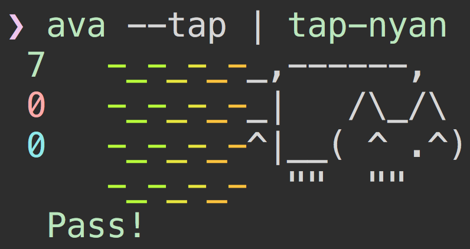
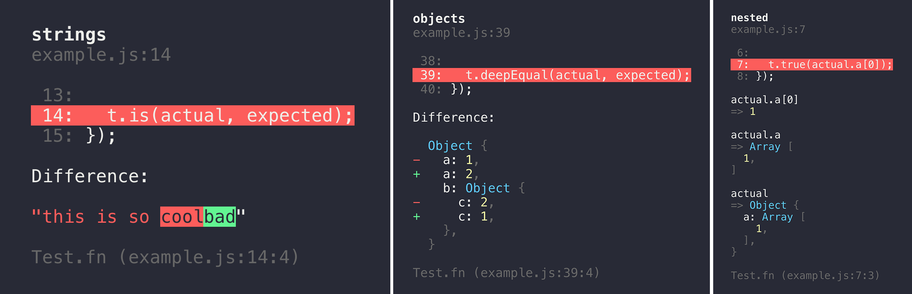
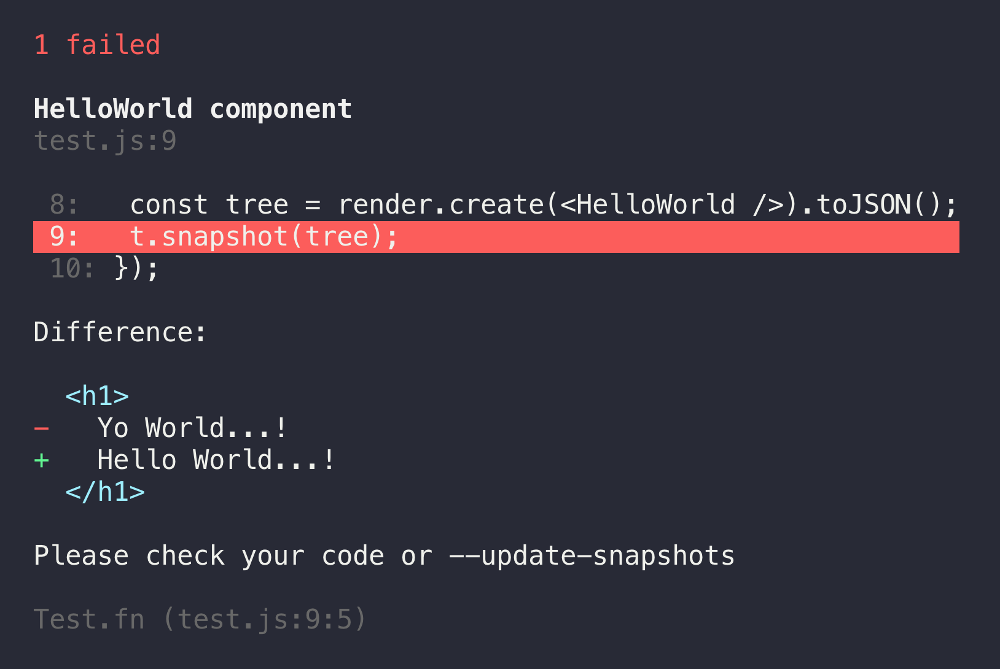

# [](https://ava.li)

> Futuristic test runner

[](https://travis-ci.org/avajs/ava) [](https://ci.appveyor.com/project/ava/ava/branch/master) [](https://coveralls.io/github/avajs/ava?branch=master) [](https://dependencyci.com/github/avajs/ava) [](https://github.com/sindresorhus/xo) [](https://gitter.im/avajs/ava)

Even though JavaScript is single-threaded, IO in Node.js can happen in parallel due to its async nature. AVA takes advantage of this and runs your tests concurrently, which is especially beneficial for IO heavy tests. In addition, test files are run in parallel as separate processes, giving you even better performance and an isolated environment for each test file. [Switching](https://github.com/sindresorhus/pageres/commit/663be15acb3dd2eb0f71b1956ef28c2cd3fdeed0) from Mocha to AVA in Pageres brought the test time down from 31 to 11 seconds. Having tests run concurrently forces you to write atomic tests, meaning tests don't depend on global state or the state of other tests, which is a great thing!


*Read our [contributing guide](contributing.md) if you're looking to contribute (issues/PRs/etc).*

Follow the [AVA Twitter account](https://twitter.com/ava__js) for updates.

Translations: [Español](https://github.com/avajs/ava-docs/blob/master/es_ES/readme.md), [Français](https://github.com/avajs/ava-docs/blob/master/fr_FR/readme.md), [Italiano](https://github.com/avajs/ava-docs/blob/master/it_IT/readme.md), [日本語](https://github.com/avajs/ava-docs/blob/master/ja_JP/readme.md), [한국어](https://github.com/avajs/ava-docs/blob/master/ko_KR/readme.md), [Português](https://github.com/avajs/ava-docs/blob/master/pt_BR/readme.md), [Русский](https://github.com/avajs/ava-docs/blob/master/ru_RU/readme.md), [简体中文](https://github.com/avajs/ava-docs/blob/master/zh_CN/readme.md)


## Contents

- [Usage](#usage)
- [CLI Usage](#cli)
- [Debugging](#debugging)
- [Reporters](#reporters)
- [Configuration](#configuration)
- [Documentation](#documentation)
- [API](#api)
- [Assertions](#assertions)
- [Snapshot testing](#snapshot-testing)
- [Tips](#tips)
- [FAQ](#faq)
- [Recipes](#recipes)
- [Support](#support)
- [Related](#related)
- [Links](#links)
- [Team](#team)


## Why AVA?

- Minimal and fast
- Simple test syntax
- Runs tests concurrently
- Enforces writing atomic tests
- No implicit globals
- Includes TypeScript & Flow type definitions
- [Magic assert](#magic-assert)
- [Isolated environment for each test file](#process-isolation)
- [Write your tests in ES2017](#es2017-support)
- [Promise support](#promise-support)
- [Generator function support](#generator-function-support)
- [Async function support](#async-function-support)
- [Observable support](#observable-support)
- [Enhanced assertion messages](#enhanced-assertion-messages)
- [TAP reporter](#tap-reporter)
- [Automatic migration from other test runners](https://github.com/avajs/ava-codemods#migrating-to-ava)


## Test syntax

```js
import test from 'ava';

test(t => {
	t.deepEqual([1, 2], [1, 2]);
});
```

## Usage

### Add AVA to your project

Install AVA globally and run it with `--init` to add AVA to your `package.json`. [Yarn](https://yarnpkg.com/) currently provides significant speed improvements over npm during the installation process. Consider [using Yarn](https://yarnpkg.com/en/docs/install) if the installation is too slow for your needs.


```console
$ yarn global add ava
$ ava --init
```

If you prefer using npm:

```console
$ npm install --global ava
$ ava --init
```

Your `package.json` will then look like this:

```json
{
  "name": "awesome-package",
  "scripts": {
    "test": "ava"
  },
  "devDependencies": {
    "ava": "^0.18.0"
  }
}
```

Any arguments passed after `--init` are added as config to `package.json`.

#### Manual installation

You can also install AVA directly:

```console
$ yarn add --dev ava
```

Alternatively using npm:

```console
$ npm install --save-dev ava
```

You'll have to configure the `test` script in your `package.json` to use `ava` (see above).

### Create your test file

Create a file named `test.js` in the project root directory:

```js
import test from 'ava';

test('foo', t => {
	t.pass();
});

test('bar', async t => {
	const bar = Promise.resolve('bar');

	t.is(await bar, 'bar');
});
```

### Run it

```console
$ npm test
```

### Watch it

```console
$ npm test -- --watch
```

AVA comes with an intelligent watch mode. [Learn more in its recipe](docs/recipes/watch-mode.md).

## CLI

```console
$ ava --help

  Usage
    ava [<file|directory|glob> ...]

  Options
    --init                  Add AVA to your project
    --fail-fast             Stop after first test failure
    --serial, -s            Run tests serially
    --tap, -t               Generate TAP output
    --verbose, -v           Enable verbose output
    --no-cache              Disable the transpiler cache
    --no-power-assert       Disable Power Assert
    --color                 Force color output
    --no-color              Disable color output
    --match, -m             Only run tests with matching title (Can be repeated)
    --watch, -w             Re-run tests when tests and source files change
    --timeout, -T           Set global timeout
    --concurrency, -c       Maximum number of test files running at the same time (EXPERIMENTAL)
    --update-snapshots, -u  Update snapshots

  Examples
    ava
    ava test.js test2.js
    ava test-*.js
    ava test
    ava --init
    ava --init foo.js

  Default patterns when no arguments:
  test.js test-*.js test/**/*.js **/__tests__/**/*.js **/*.test.js
```

*Note that the CLI will use your local install of AVA when available, even when run globally.*

Directories are recursed, with all `*.js` files being treated as test files. Directories named `fixtures`, `helpers` and `node_modules` are *always* ignored. So are files starting with `_` which allows you to place helpers in the same directory as your test files.

When using `npm test`, you can pass positional arguments directly `npm test test2.js`, but flags needs to be passed like `npm test -- --verbose`.


## Debugging

AVA runs tests in child processes, so to debug tests, you need to do this workaround:

```console
$ node --inspect node_modules/ava/profile.js some/test/file.js
```

### Debugger-specific tips

- [Chrome DevTools](docs/recipes/debugging-with-chrome-devtools.md)
- [WebStorm](docs/recipes/debugging-with-webstorm.md)


## Reporters

### Mini-reporter

The mini-reporter is the default reporter.


### Verbose reporter

Use the `--verbose` flag to enable the verbose reporter. This is always used in CI environments unless the [TAP reporter](#tap-reporter) is enabled.


### TAP reporter

AVA supports the TAP format and thus is compatible with [any TAP reporter](https://github.com/sindresorhus/awesome-tap#reporters). Use the `--tap` flag to enable TAP output.

```console
$ ava --tap | tap-nyan
```



Please note that the TAP reporter is unavailable when using [watch mode](#watch-it).

### Magic assert

AVA adds code excerpts and clean diffs for actual and expected values. If values in the assertion are objects or arrays, only a diff is displayed, to remove the noise and focus on the problem. The diff is syntax-highlighted too! If you are comparing strings, both single and multi line, AVA displays a different kind of output, highlighting the added or missing characters.



### Clean stack traces

AVA automatically removes unrelated lines in stack traces, allowing you to find the source of an error much faster, as seen above.


## Configuration

All of the CLI options can be configured in the `ava` section of your `package.json`. This allows you to modify the default behavior of the `ava` command, so you don't have to repeatedly type the same options on the command prompt.

```json
{
  "ava": {
    "files": [
      "my-test-folder/*.js",
      "!**/not-this-file.js"
    ],
    "source": [
      "**/*.{js,jsx}",
      "!dist/**/*"
    ],
    "match": [
      "*oo",
      "!foo"
    ],
    "concurrency": 5,
    "failFast": true,
    "failWithoutAssertions": false,
    "tap": true,
    "powerAssert": false,
    "require": [
      "babel-register"
    ],
    "babel": "inherit"
  }
}
```

Arguments passed to the CLI will always take precedence over the configuration in `package.json`.

See the [ES2017 support](#es2017-support) section for details on the `babel` option.

## Documentation

Tests are run concurrently. You can specify synchronous and asynchronous tests. Tests are considered synchronous unless you return a promise or [observable](https://github.com/zenparsing/zen-observable).

We *highly* recommend the use of [async functions](#async-function-support). They make asynchronous code concise and readable, and they implicitly return a promise so you don't have to.

If you're unable to use promises or observables, you may enable "callback mode" by defining your test with `test.cb([title], fn)`. Tests declared this way **must** be manually ended with `t.end()`. This mode is mainly intended for testing callback-style APIs. However, we would strongly recommend [promisifying](https://github.com/sindresorhus/pify) callback-style APIs instead of using "callback mode", as this results in more correct and readable tests.

You must define all tests synchronously. They can't be defined inside `setTimeout`, `setImmediate`, etc.

AVA tries to run test files with their current working directory set to the directory that contains your `package.json` file.

### Creating tests

To create a test you call the `test` function you imported from AVA. Provide the optional title and implementation function. The function will be called when your test is run. It's passed an [execution object](#t) as its first argument.

**Note:** In order for the [enhanced assertion messages](#enhanced-assertion-messages) to behave correctly, the first argument **must** be named `t`.

```js
import test from 'ava';

test('my passing test', t => {
	t.pass();
});
```

#### Titles

Titles are optional, meaning you can do:

```js
test(t => {
	t.pass();
});
```

It's recommended to provide test titles if you have more than one test.

If you haven't provided a test title, but the implementation is a named function, that name will be used as the test title:

```js
test(function name(t) {
	t.pass();
});
```

### Assertion planning

Assertion plans ensure tests only pass when a specific number of assertions have been executed. They'll help you catch cases where tests exit too early. They'll also cause tests to fail if too many assertions are executed, which can be useful if you have assertions inside callbacks or loops.

If you do not specify an assertion plan, your test will still fail if no assertions are executed. Set the `failWithoutAssertions` option to `false` in AVA's [`package.json` configuration](#configuration) to disable this behavior.

Note that, unlike [`tap`](https://www.npmjs.com/package/tap) and [`tape`](https://www.npmjs.com/package/tape), AVA does *not* automatically end a test when the planned assertion count is reached.

These examples will result in a passed test:

```js
test(t => {
	t.plan(1);

	return Promise.resolve(3).then(n => {
		t.is(n, 3);
	});
});

test.cb(t => {
	t.plan(1);

	someAsyncFunction(() => {
		t.pass();
		t.end();
	});
});
```

These won't:

```js
test(t => {
	t.plan(2);

	for (let i = 0; i < 3; i++) {
		t.true(i < 3);
	}
}); // Fails, 3 assertions are executed which is too many

test(t => {
	t.plan(1);

	someAsyncFunction(() => {
		t.pass();
	});
}); // Fails, the test ends synchronously before the assertion is executed
```

### Running tests serially

By default tests are run concurrently, which is awesome. Sometimes though you have to write tests that cannot run concurrently.

In these rare cases you can use the `.serial` modifier. It will force those tests to run serially *before* the concurrent ones.

```js
test.serial(t => {
	t.pass();
});
```

Note that this only applies to tests within a particular test file. AVA will still run multiple tests files at the same time unless you pass the [`--serial` CLI flag](#cli).

### Running specific tests

During development it can be helpful to only run a few specific tests. This can be accomplished using the `.only` modifier:

```js
test('will not be run', t => {
	t.fail();
});

test.only('will be run', t => {
	t.pass();
});
```

`.only` applies across all test files, so if you use it in one file, no tests from the other file will run.

### Running tests with matching titles

The `--match` flag allows you to run just the tests that have a matching title. This is achieved with simple wildcard patterns. Patterns are case insensitive. See [`matcher`](https://github.com/sindresorhus/matcher) for more details.

Match titles ending with `foo`:

```console
$ ava --match='*foo'
```

Match titles starting with `foo`:

```console
$ ava --match='foo*'
```

Match titles containing `foo`:

```console
$ ava --match='*foo*'
```

Match titles that are *exactly* `foo` (albeit case insensitively):

```console
$ ava --match='foo'
```

Match titles not containing `foo`:

```console
$ ava --match='!*foo*'
```

Match titles starting with `foo` and ending with `bar`:

```console
$ ava --match='foo*bar'
```

Match titles starting with `foo` or ending with `bar`:

```console
$ ava --match='foo*' --match='*bar'
```

Note that a match pattern takes precedence over the `.only` modifier. Only tests with an explicit title are matched. Tests without titles or whose title is derived from the implementation function will be skipped when `--match` is used.

Here's what happens when you run AVA with a match pattern of `*oo*` and the following tests:

```js
test('foo will run', t => {
	t.pass();
});

test('moo will also run', t => {
	t.pass();
});

test.only('boo will run but not exclusively', t => {
	t.pass();
});

// Won't run, no title
test(function (t) {
	t.fail();
});

// Won't run, no explicit title
test(function foo(t) {
	t.fail();
});
```

### Skipping tests

Sometimes failing tests can be hard to fix. You can tell AVA to skip these tests using the `.skip` modifier. They'll still be shown in the output (as having been skipped) but are never run.

```js
test.skip('will not be run', t => {
	t.fail();
});
```

You must specify the implementation function.

### Test placeholders ("todo")

You can use the `.todo` modifier when you're planning to write a test. Like skipped tests these placeholders are shown in the output. They only require a title; you cannot specify the implementation function.

```js
test.todo('will think about writing this later');
```

### Failing tests

You can use the `.failing` modifier to document issues with your code that need to be fixed. Failing tests are run just like normal ones, but they are expected to fail, and will not break your build when they do. If a test marked as failing actually passes, it will be reported as an error and fail the build with a helpful message instructing you to remove the `.failing` modifier.

This allows you to merge `.failing` tests before a fix is implemented without breaking CI. This is a great way to recognize good bug report PR's with a commit credit, even if the reporter is unable to actually fix the problem.

```js
// See: github.com/user/repo/issues/1234
test.failing('demonstrate some bug', t => {
	t.fail(); // Test will count as passed
});
```

### Before & after hooks

AVA lets you register hooks that are run before and after your tests. This allows you to run setup and/or teardown code.

`test.before()` registers a hook to be run before the first test in your test file. Similarly `test.after()` registers a hook to be run after the last test. Use `test.after.always()` to register a hook that will **always** run once your tests and other hooks complete. `.always()` hooks run regardless of whether there were earlier failures, so they are ideal for cleanup tasks. There are two exceptions to this however. If you use `--fail-fast` AVA will stop testing as soon as a failure occurs, and it won't run any hooks including the `.always()` hooks. Uncaught exceptions will crash your tests, possibly preventing `.always()` hooks from running.

`test.beforeEach()` registers a hook to be run before each test in your test file. Similarly `test.afterEach()` a hook to be run after each test. Use `test.afterEach.always()` to register an after hook that is called even if other test hooks, or the test itself, fail. `.always()` hooks are ideal for cleanup tasks.

**Note**: If the `--fail-fast` flag is specified, AVA will stop after the first test failure and the `.always` hook will **not** run.

Like `test()` these methods take an optional title and a callback function. The title is shown if your hook fails to execute. The callback is called with an [execution object](#t).

`before` hooks execute before `beforeEach` hooks. `afterEach` hooks execute before `after` hooks. Within their category the hooks execute in the order they were defined.

```js
test.before(t => {
	// This runs before all tests
});

test.before(t => {
	// This runs after the above, but before tests
});

test.after('cleanup', t => {
	// This runs after all tests
});

test.after.always('guaranteed cleanup', t => {
	// This will always run, regardless of earlier failures
});

test.beforeEach(t => {
	// This runs before each test
});

test.afterEach(t => {
	// This runs after each test
});

test.afterEach.always(t => {
	// This runs after each test and other test hooks, even if they failed
});

test(t => {
	// Regular test
});
```

Hooks can be synchronous or asynchronous, just like tests. To make a hook asynchronous return a promise or observable, use an async function, or enable callback mode via `test.cb.before()`, `test.cb.beforeEach()` etc.

```js
test.before(async t => {
	await promiseFn();
});

test.after(t => {
	return new Promise(/* ... */);
});

test.cb.beforeEach(t => {
	setTimeout(t.end);
});

test.afterEach.cb(t => {
	setTimeout(t.end);
});
```

Keep in mind that the `beforeEach` and `afterEach` hooks run just before and after a test is run, and that by default tests run concurrently. If you need to set up global state for each test (like spying on `console.log` [for example](https://github.com/avajs/ava/issues/560)), you'll need to make sure the tests are [run serially](#running-tests-serially).

Remember that AVA runs each test file in its own process. You may not have to clean up global state in a `after`-hook since that's only called right before the process exits.

#### Test context

The `beforeEach` & `afterEach` hooks can share context with the test:

```js
test.beforeEach(t => {
	t.context.data = generateUniqueData();
});

test(t => {
	t.is(t.context.data + 'bar', 'foobar');
});
```

The context is not shared between tests, allowing you to set up data in a way where it will not risk leaking to other, subsequent tests. By default `t.context` is an object but you can reassign it:

```js
test.beforeEach(t => {
	t.context = 'unicorn';
});

test(t => {
	t.is(t.context, 'unicorn');
});
```

Context sharing is *not* available to `before` and `after` hooks.

### Chaining test modifiers

You can use the `.serial`, `.only` and `.skip` modifiers in any order, with `test`, `before`, `after`, `beforeEach` and `afterEach`. For example:

```js
test.before.skip(...);
test.skip.after(...);
test.serial.only(...);
test.only.serial(...);
```

This means you can temporarily add `.skip` or `.only` at the end of a test or hook definition without having to make any other changes.

### Test macros

Additional arguments passed to the test declaration will be passed to the test implementation. This is useful for creating reusable test macros.

```js
function macro(t, input, expected) {
	t.is(eval(input), expected);
}

test('2 + 2 === 4', macro, '2 + 2', 4);
test('2 * 3 === 6', macro, '2 * 3', 6);
```

You can build the test title programmatically by attaching a `title` function to the macro:

```js
function macro(t, input, expected) {
	t.is(eval(input), expected);
}

macro.title = (providedTitle, input, expected) => `${providedTitle} ${input} === ${expected}`.trim();

test(macro, '2 + 2', 4);
test(macro, '2 * 3', 6);
test('providedTitle', macro, '3 * 3', 9);
```

The `providedTitle` argument defaults to an empty string if the user does not supply a string title. This allows for easy concatenation without having to worry about `null` / `undefined`. It is worth remembering that the empty string is considered a falsy value, so you can still use `if(providedTitle) {...}`.

You can also pass arrays of macro functions:

```js
const safeEval = require('safe-eval');

function evalMacro(t, input, expected) {
	t.is(eval(input), expected);
}

function safeEvalMacro(t, input, expected) {
	t.is(safeEval(input), expected);
}

test([evalMacro, safeEvalMacro], '2 + 2', 4);
test([evalMacro, safeEvalMacro], '2 * 3', 6);
```

We encourage you to use macros instead of building your own test generators ([here is an example](https://github.com/avajs/ava-codemods/blob/47073b5b58aa6f3fb24f98757be5d3f56218d160/test/ok-to-truthy.js#L7-L9) of code that should be replaced with a macro). Macros are designed to perform static analysis of your code, which can lead to better performance, IDE integration, and linter rules.

### Custom assertions

You can use any assertion library instead of or in addition to the built-in one, provided it throws exceptions when the assertion fails.

This won't give you as nice an experience as you'd get with the [built-in assertions](#assertions) though, and you won't be able to use the [assertion planning](#assertion-planning) ([see #25](https://github.com/avajs/ava/issues/25)).

You'll have to configure AVA to not fail tests if no assertions are executed, because AVA can't tell if custom assertions pass. Set the `failWithoutAssertions` option to `false` in AVA's [`package.json` configuration](#configuration).

```js
import assert from 'assert';

test(t => {
	assert(true);
});
```

### ES2017 support

AVA comes with built-in support for ES2017 through [Babel 6](https://babeljs.io). Just write your tests in ES2017. No extra setup needed. You can use any Babel version in your project. We use our own bundled Babel with our [`@ava/stage-4`](https://github.com/avajs/babel-preset-stage-4) preset, as well as [custom transforms](https://github.com/avajs/babel-preset-transform-test-files) for test and helper files.

The corresponding Babel config for AVA's setup is as follows:

```json
{
  "presets": [
    "@ava/stage-4",
    "@ava/transform-test-files"
  ]
}
```

You can customize how AVA transpiles the test files through the `babel` option in AVA's [`package.json` configuration](#configuration). For example to override the presets you can use:

```json
{
  "ava": {
     "babel": {
       "presets": [
          "es2015",
          "stage-0",
          "react"
       ]
     }
  }
}
```

You can also use the special `"inherit"` keyword. This makes AVA defer to the Babel config in your [`.babelrc` or `package.json` file](https://babeljs.io/docs/usage/babelrc/). This way your test files will be transpiled using the same config as your source files without having to repeat it just for AVA:

```json
{
  "babel": {
    "presets": [
      "es2015",
      "stage-0",
      "react"
    ]
  },
  "ava": {
    "babel": "inherit"
  }
}
```

See AVA's [`.babelrc` recipe](docs/recipes/babelrc.md) for further examples and a more detailed explanation of configuration options.

Note that AVA will *always* apply [a few internal plugins](docs/recipes/babelrc.md#notes) regardless of configuration, but they should not impact the behavior of your code.

### TypeScript support

AVA includes typings for TypeScript. You have to set up transpilation yourself. When you set `module` to `commonjs` in your `tsconfig.json` file, TypeScript will automatically find the type definitions for AVA. You should set `target` to `es2015` to use promises and async functions.

See AVA's [TypeScript recipe](docs/recipes/typescript.md) for a more detailed explanation.

### Transpiling imported modules

AVA currently only transpiles the tests you ask it to run, as well as test helpers (files starting with `_` or in `helpers` directory) inside the test directory. *It will not transpile modules you `import` from outside of the test.* This may be unexpected but there are workarounds.

If you use Babel you can use its [require hook](https://babeljs.io/docs/usage/require/) to transpile imported modules on-the-fly. To add it, [configure it in your `package.json`](#configuration).

You can also transpile your modules in a separate process and refer to the transpiled files rather than the sources from your tests. Example [here](docs/recipes/precompiling-with-webpack.md).

### Promise support

If you return a promise in the test you don't need to explicitly end the test as it will end when the promise resolves.

```js
test(t => {
	return somePromise().then(result => {
		t.is(result, 'unicorn');
	});
});
```

### Generator function support

AVA comes with built-in support for [generator functions](https://developer.mozilla.org/en-US/docs/Web/JavaScript/Reference/Statements/function*).

```js
test(function * (t) {
	const value = yield generatorFn();
	t.true(value);
});
```

### Async function support

AVA comes with built-in support for [async functions](https://tc39.github.io/ecmascript-asyncawait/) *(async/await)*.

```js
test(async function (t) {
	const value = await promiseFn();
	t.true(value);
});

// Async arrow function
test(async t => {
	const value = await promiseFn();
	t.true(value);
});
```

### Observable support

AVA comes with built-in support for [observables](https://github.com/zenparsing/es-observable). If you return an observable from a test, AVA will automatically consume it to completion before ending the test.

*You do not need to use "callback mode" or call `t.end()`.*

```js
test(t => {
	t.plan(3);
	return Observable.of(1, 2, 3, 4, 5, 6)
		.filter(n => {
			// Only even numbers
			return n % 2 === 0;
		})
		.map(() => t.pass());
});
```

### Callback support

AVA supports using `t.end` as the final callback when using node-style error-first callback APIs. AVA will consider any truthy value passed as the first argument to `t.end` to be an error. Note that `t.end` requires "callback mode", which can be enabled by using the `test.cb` chain.

```js
test.cb(t => {
	// `t.end` automatically checks for error as first argument
	fs.readFile('data.txt', t.end);
});
```

### Global timeout

A global timeout can be set via the `--timeout` option.
Timeout in AVA behaves differently than in other test frameworks.
AVA resets a timer after each test, forcing tests to quit if no new test results were received within the specified timeout.

You can set timeouts in a human-readable way:

```console
$ ava --timeout=10s # 10 seconds
$ ava --timeout=2m # 2 minutes
$ ava --timeout=100 # 100 milliseconds
```

## API

### `test([title], implementation)`
### `test.serial([title], implementation)`
### `test.cb([title], implementation)`
### `test.only([title], implementation)`
### `test.skip([title], implementation)`
### `test.todo(title)`
### `test.failing([title], implementation)`
### `test.before([title], implementation)`
### `test.after([title], implementation)`
### `test.beforeEach([title], implementation)`
### `test.afterEach([title], implementation)`

#### `title`

Type: `string`

Test title.

#### `implementation(t)`

Type: `function`

Should contain the actual test.

##### `t`

Type: `object`

The execution object of a particular test. Each test implementation receives a different object. Contains the [assertions](#assertions) as well as `.plan(count)` and `.end()` methods. `t.context` can contain shared state from `beforeEach` hooks.

###### `t.plan(count)`

Plan how many assertion there are in the test. The test will fail if the actual assertion count doesn't match the number of planned assertions. See [assertion planning](#assertion-planning).

###### `t.end()`

End the test. Only works with `test.cb()`.

## Assertions

Assertions are mixed into the [execution object](#t) provided to each test implementation:

```js
test(t => {
	t.truthy('unicorn'); // Assertion
});
```

If multiple assertion failures are encountered within a single test, AVA will only display the *first* one.

### `.pass([message])`

Passing assertion.

### `.fail([message])`

Failing assertion.

### `.truthy(value, [message])`

Assert that `value` is truthy.

### `.falsy(value, [message])`

Assert that `value` is falsy.

### `.true(value, [message])`

Assert that `value` is `true`.

### `.false(value, [message])`

Assert that `value` is `false`.

### `.is(value, expected, [message])`

Assert that `value` is equal to `expected`.

### `.not(value, expected, [message])`

Assert that `value` is not equal to `expected`.

### `.deepEqual(value, expected, [message])`

Assert that `value` is deep equal to `expected`. This is based on [Lodash' `isEqual()`](https://lodash.com/docs/4.17.4#isEqual):

> Performs a deep comparison between two values to determine if they are equivalent.
>
> *Note*: This method supports comparing arrays, array buffers, booleans, date objects, error objects, maps, numbers, `Object` objects, regexes, sets, strings, symbols, and typed arrays. `Object` objects are compared by their own, not inherited, enumerable properties. Functions and DOM nodes are compared by strict equality, i.e. `===`.

### `.notDeepEqual(value, expected, [message])`

Assert that `value` is not deep equal to `expected`. The inverse of `.deepEqual()`.

### `.throws(function|promise, [error, [message]])`

Assert that `function` throws an error, or `promise` rejects with an error.

`error` can be an error constructor, error message, regex matched against the error message, or validation function.

Returns the error thrown by `function` or a promise for the rejection reason of the specified `promise`.

Example:

```js
const fn = () => {
	throw new TypeError('🦄');
};

test('throws', t => {
	const error = t.throws(() => {
		fn();
	}, TypeError);

	t.is(error.message, '🦄');
});
```

```js
const promise = Promise.reject(new TypeError('🦄'));

test('rejects', async t => {
	const error = await t.throws(promise);
	t.is(error.message, '🦄');
});
```

When testing a promise you must wait for the assertion to complete:

```js
test('rejects', async t => {
	await t.throws(promise);
});
```

### `.notThrows(function|promise, [message])`

Assert that `function` does not throw an error or that `promise` does not reject with an error.

Like the `.throws()` assertion, when testing a promise you must wait for the assertion to complete:

```js
test('rejects', async t => {
	await t.notThrows(promise);
});
```

### `.regex(contents, regex, [message])`

Assert that `contents` matches `regex`.

### `.notRegex(contents, regex, [message])`

Assert that `contents` does not match `regex`.

### `.ifError(error, [message])`

Assert that `error` is falsy.

### `.snapshot(contents, [message])`

Make a snapshot of the stringified `contents`.

## Snapshot testing

Snapshot testing comes as another kind of assertion and uses [jest-snapshot](https://facebook.github.io/jest/blog/2016/07/27/jest-14.html) under the hood.

When used with React, it looks very similar to Jest:

```js
// Your component
const HelloWorld = () => <h1>Hello World...!</h1>;

export default HelloWorld;
```

```js
// Your test
import test from 'ava';
import render from 'react-test-renderer';

import HelloWorld from '.';

test('HelloWorld component', t => {
	const tree = render.create(<HelloWorld />).toJSON();
	t.snapshot(tree);
});
```

The first time you run this test, a snapshot file will be created in `__snapshots__` folder looking something like this:

```js
exports[`HelloWorld component 1`] = `
<h1>
	Hello World...!
</h1>
`;
```

These snapshots should be committed together with your code so that everyone on the team shares current state of the app.

Every time you run this test afterwards, it will check if the component render has changed. If it did, it will fail the test.



Then you will have the choice to check your code - and if the change was intentional, you can use the `--update-snapshots` (or `-u`) flag to update the snapshots into their new version.

That might look like this:

```console
$ ava --update-snapshots
```

Note that snapshots can be used for much more than just testing components - you can equally well test any other (data) structure that you can stringify.

### Skipping assertions

Any assertion can be skipped using the `skip` modifier. Skipped assertions are still counted, so there is no need to change your planned assertion count.

```js
test(t => {
	t.plan(2);
	t.skip.is(foo(), 5); // No need to change your plan count when skipping
	t.is(1, 1);
});
```

### Enhanced assertion messages

AVA comes with [`power-assert`](https://github.com/power-assert-js/power-assert) built-in, giving you more descriptive assertion messages. It reads your test and tries to infer more information from the code.

Let's take this example, using Node's standard [`assert` library](https://nodejs.org/api/assert.html):

```js
const a = /foo/;
const b = 'bar';
const c = 'baz';
require('assert').ok(a.test(b) || b === c);
```

If you paste that into a Node REPL it'll return:

```
AssertionError: false == true
```

In AVA however, this test:

```js
test(t => {
	const a = /foo/;
	const b = 'bar';
	const c = 'baz';
	t.true(a.test(b) || b === c);
});
```

Will output:

```
t.true(a.test(b) || b === c)
       |      |     |     |
       |      "bar" "bar" "baz"
       false
```

## Process isolation

Each test file is run in a separate Node.js process. This allows you to change the global state or overriding a built-in in one test file, without affecting another. It's also great for performance on modern multi-core processors, allowing multiple test files to execute in parallel.

## Tips

### Temp files

Running tests concurrently comes with some challenges, doing file IO is one.

Usually, serial tests create temp directories in the current test directory and clean them up at the end. This won't work when you run tests concurrently as tests will conflict with each other. The correct way to do it is to use a new temp directory for each test. The [`tempfile`](https://github.com/sindresorhus/tempfile) and [`temp-write`](https://github.com/sindresorhus/temp-write) modules can be helpful.

### Code coverage

You can't use [`istanbul`](https://github.com/gotwarlost/istanbul) for code coverage as AVA [spawns the test files](#process-isolation). You can use [`nyc`](https://github.com/bcoe/nyc) instead, which is basically `istanbul` with support for subprocesses.

As of version `5.0.0` it uses source maps to report coverage for your actual code, regardless of transpilation. Make sure that the code you're testing includes an inline source map or references a source map file. If you use `babel-register` you can set the `sourceMaps` option in your Babel config to `inline`.

### Common pitfalls

We have a growing list of [common pitfalls](docs/common-pitfalls.md) you may experience while using AVA. If you encounter any issues you think are common, comment in [this issue](https://github.com/avajs/ava/issues/404).

## FAQ

### Why not `mocha`, `tape`, `tap`?

Mocha requires you to use implicit globals like `describe` and `it` with the default interface (which most people use). It's not very opinionated and executes tests serially without process isolation, making it slow.

Tape and tap are pretty good. AVA is highly inspired by their syntax. They too execute tests serially. Their default [TAP](https://testanything.org) output isn't very user-friendly though so you always end up using an external tap reporter.

In contrast AVA is highly opinionated and runs tests concurrently, with a separate process for each test file. Its default reporter is easy on the eyes and yet AVA still supports TAP output through a CLI flag.

### How is the name written and pronounced?

AVA, not Ava or ava. Pronounced [`/ˈeɪvə/` ay-və](media/pronunciation.m4a?raw=true).

### What is the header background?

It's the [Andromeda galaxy](https://simple.wikipedia.org/wiki/Andromeda_galaxy).

### What is the difference between concurrency and parallelism?

[Concurrency is not parallelism. It enables parallelism.](https://stackoverflow.com/q/1050222)

## Recipes

- [Code coverage](docs/recipes/code-coverage.md)
- [Watch mode](docs/recipes/watch-mode.md)
- [Endpoint testing](docs/recipes/endpoint-testing.md)
- [When to use `t.plan()`](docs/recipes/when-to-use-plan.md)
- [Browser testing](docs/recipes/browser-testing.md)
- [TypeScript](docs/recipes/typescript.md)
- [Configuring Babel](docs/recipes/babelrc.md)
- [Testing React components](docs/recipes/react.md)
- [JSPM and SystemJS](docs/recipes/jspm-systemjs.md)
- [Debugging tests with Chrome DevTools](docs/recipes/debugging-with-chrome-devtools.md)
- [Debugging tests with WebStorm](docs/recipes/debugging-with-webstorm.md)
- [Precompiling source files with webpack](docs/recipes/precompiling-with-webpack.md)

## Support

- [Stack Overflow](https://stackoverflow.com/questions/tagged/ava)
- [Gitter chat](https://gitter.im/avajs/ava)
- [Twitter](https://twitter.com/ava__js)

## Related

- [eslint-plugin-ava](https://github.com/avajs/eslint-plugin-ava) - Lint rules for AVA tests
- [sublime-ava](https://github.com/avajs/sublime-ava) - Snippets for AVA tests
- [atom-ava](https://github.com/avajs/atom-ava) - Snippets for AVA tests
- [vscode-ava](https://github.com/samverschueren/vscode-ava) - Snippets for AVA tests
- [gulp-ava](https://github.com/avajs/gulp-ava) - Run tests with gulp
- [grunt-ava](https://github.com/avajs/grunt-ava) - Run tests with grunt
- [More…](https://github.com/avajs/awesome-ava#packages)

## Links

- [Buy AVA stickers](https://www.stickermule.com/user/1070705604/stickers)
- [Awesome list](https://github.com/avajs/awesome-ava)
- [AVA Casts](http://avacasts.com)
- [More…](https://github.com/avajs/awesome-ava)

## Team

[](http://sindresorhus.com) | [](https://github.com/vadimdemedes) | [](https://github.com/jamestalmage) | [](https://novemberborn.net) | [](https://juansoto.me) | [](https://github.com/jfmengels)
---|---|---|---|---|---
[Sindre Sorhus](http://sindresorhus.com) | [Vadim Demedes](https://github.com/vadimdemedes) | [James Talmage](https://github.com/jamestalmage) | [Mark Wubben](https://novemberborn.net) | [Juan Soto](http://juansoto.me) | [Jeroen Engels](https://github.com/jfmengels)

### Former

- [Kevin Mårtensson](https://github.com/kevva)


<div align="center">
	<br>
	<br>
	<br>
	<a href="https://ava.li">
		
	</a>
	<br>
	<br>
</div>
